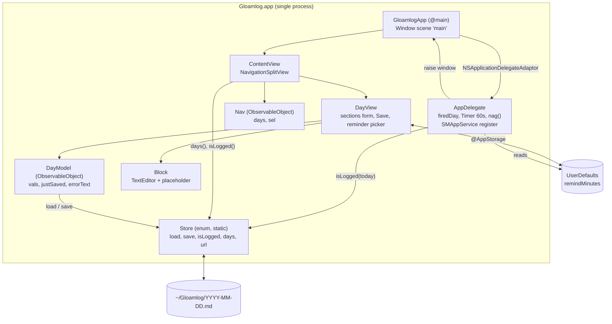
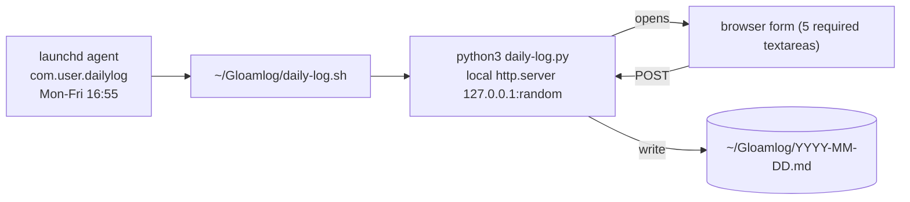

# Gloamlog: Architecture

All app code is in `app/Gloamlog.swift`. Local-only, no network. Nothing here has been executed yet; this reflects the source.

## Components

| Component | Role |
|---|---|
| `Store` | All persistence. Stateless enum: path building, day listing, markdown parse (`load`), render+atomic write (`save`), `isLogged`. Shared by every other component; knows nothing about UI. |
| `AppDelegate` | Process lifecycle. Registers login item, runs 60 s `Timer`, `nag()` decides whether to raise the window. Keeps app alive after window close. Holds `firedDay` (in-memory only). |
| `GloamlogApp` | `@main` App; one `Window("Gloamlog")`, min 820x600, default 980x740. Attaches `AppDelegate`. |
| `ContentView` + `Nav` | Sidebar (all days + today, newest first, check icon when logged) and detail. `Nav.sel` is the selected day; `Nav.days` is the cached file list, refreshed via the save callback. `DayView` gets `.id(nav.sel)` so switching days rebuilds it and its model. |
| `DayView` + `DayModel` | Editing form for one day. `DayModel` loads values from `Store` at init and holds edits; `filled` counts non-empty sections; `save()` calls `Store.save`. Save is disabled until 5/5 filled. Reminder time is edited via `@AppStorage`. |
| `Block` | Reusable `TextEditor` with placeholder; bound to one section's text. |

## Data flow: Save

1. User types in a `Block`; its binding writes `m.vals[key]` and clears `justSaved`.
2. `filled` reaches 5; "Save log" enables.
3. Click calls `DayModel.save()`, which calls `Store.save(day, vals)`.
4. `Store.save` creates `~/Gloamlog` if missing, renders `# day` plus five `## heading` sections (values trimmed), writes atomically.
5. Success: `justSaved = true`, error cleared, returns true, then `onSave` runs and `Nav.days = Store.days()` refreshes the sidebar. Failure: `errorText` shown in red, no sidebar refresh.
6. Next `nag()` tick sees `isLogged(today)` true and stops raising the window.

## Data flow: Reminder fires

1. Launch: `AppDelegate` registers as login item, schedules the 60 s timer, calls `nag()` once.
2. Each tick `nag()` evaluates: weekday in 2...6, current minutes >= `remindMinutes` (default 1015), today not logged. Any failure returns.
3. Finds the first window that `canBecomeMain`; none, return.
4. If `firedDay != today` (first time today), or the window is hidden or miniaturised: set `firedDay`, deminiaturise if needed, `makeKeyAndOrderFront`, `NSApp.activate`.
5. Otherwise (window already visible) do nothing. Repeats until the log is saved or the day rolls over.

## Legacy script version (still in repo)

`daily-log.sh` + `daily-log.py` predate the app and do the same job without it.

- `daily-log.sh install` copies both scripts into `~/Gloamlog`, writes `~/Library/LaunchAgents/com.user.dailylog.plist` (launchd `Weekday` 1-5 = Mon-Fri; 0/7 = Sunday, unlike the app's `Calendar` check of 2...6) and loads it. Time is hard-coded (`HOUR=16; MIN=55`).
- At fire time the script execs `python3 daily-log.py`, which exits immediately if today's file exists and is non-empty, otherwise serves a one-shot form on an ephemeral localhost port, opens the browser, writes the file on valid POST, then shuts down.
- Shared contract with the app: identical section keys, headings (emoji included) and file layout in `~/Gloamlog/YYYY-MM-DD.md`. The two can coexist, but should not both be scheduled, or the user gets two nags.
- Differences: script has no UI for reschedule, no persistent process, no history browsing, and treats any non-empty file as done; the app requires five non-empty sections. The two implementations duplicate the section list; keep them in sync by hand.
