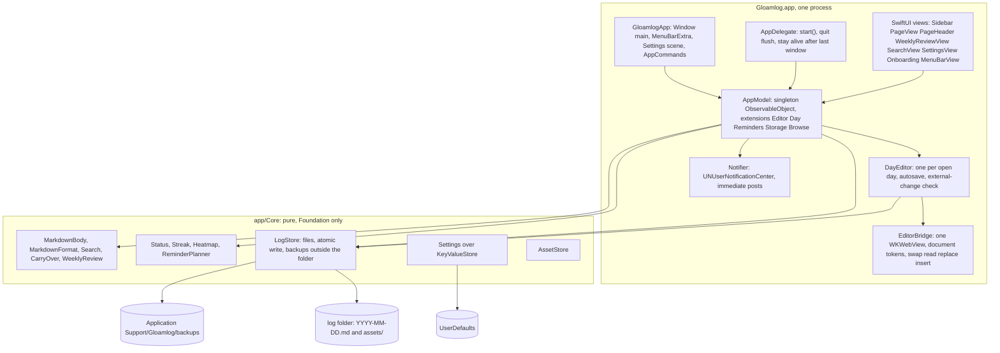
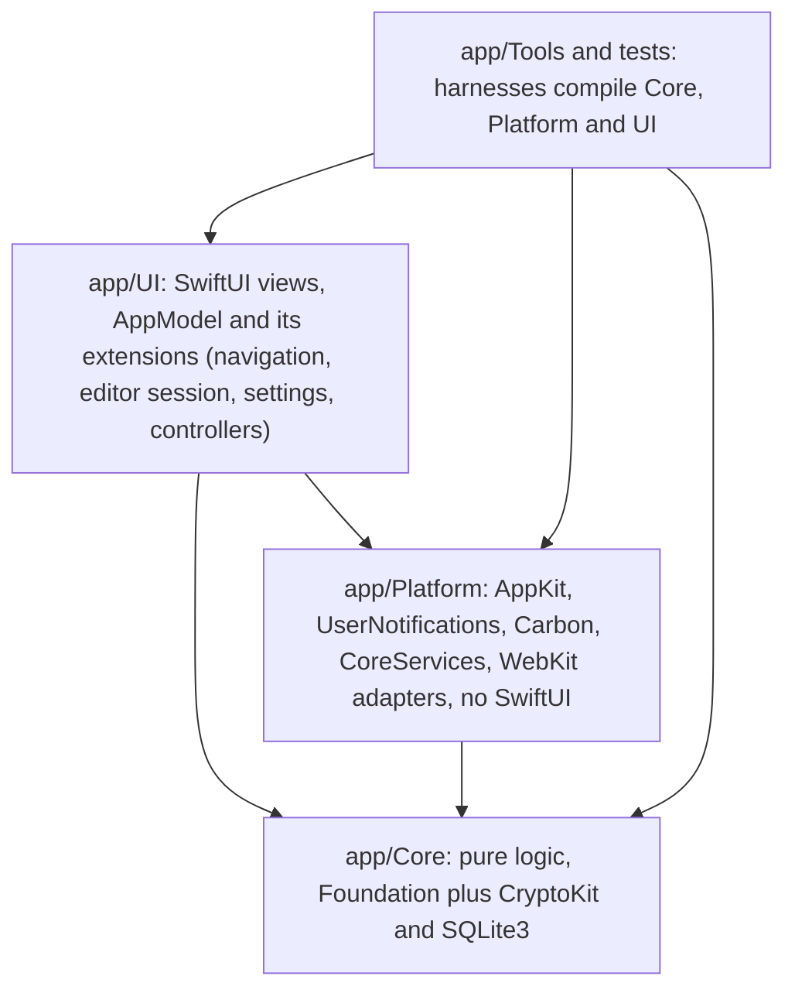
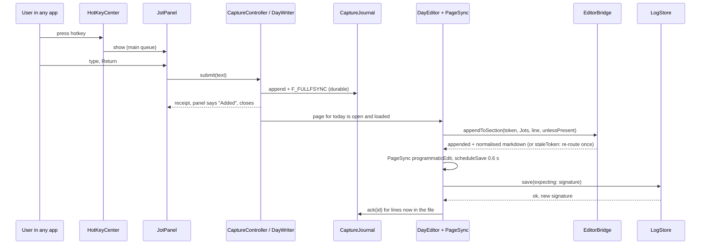

# Gloamlog v1: architecture

Status: proposal for owner review, written 2026-10-07 against the v0.3 checkpoint. Nothing here is built. This is the "how" for `docs/v1/TRD.md` (requirements, decisions D-A to D-M, budgets, task list and hours). Screens are in `docs/v1/DESIGN_V4.md`, flows, copy and the settings catalogue in `docs/v1/UX_FLOWS.md` (the behaviour authority), scope and acceptance in `docs/v1/PRD_V1.md`. It replaces `docs/ARCHITECTURE.md` and `docs/FILE_STRUCTURE.md`, which describe the single-file v0.1 app.

Reading guide: section 2 is the code as it is. Section 3 is the target shape. Section 5 has one subsection per decision (5.A to 5.M) with files, types, algorithms, failure handling, migration, tests and tasks. Section 6 has the formats. Section 7 is the order of change.

Tags as in the TRD: **[code]** read from source, **[measured]**, **[verify]** (a spike exists, TRD section 9). Code blocks are sketches in the repository's style (Swift 5 mode, no macros, `ObservableObject`); they have not been compiled unless a sentence says so.

## 1. Constraints that shape every choice

- macOS 13+ deployment target, built with Command Line Tools only (`swiftc`, no Xcode project, no SwiftPM, no macros, no third-party code). `-target <arch>-apple-macos13.0` is the availability gate; the owner's Mac runs macOS 27.0.1 with SDK 27.0 [measured].
- Swift 5 language mode (`-swift-version 5`) under a Swift 6.4 compiler. UI state through `ObservableObject`, `@Published`, `@StateObject`, `Box<T>`; never `@State`, `@Observable`, `#Preview`.
- Local-first markdown: one `YYYY-MM-DD.md` per day plus `assets/`. No network, no telemetry (the optional update check, L6, is the single exception and lives in one file).
- One prebuilt WebKit editor bundle (`app/Resources/editor/index.html`), one shared `WKWebView` (`EditorBridge`). The editor contract (`docs/EDITOR_CONTRACT.md`) changes by one additive call in v1, `appendToSection(heading, markdown)` (5.D, UX_FLOWS 5.5); every other new behaviour uses `swapDocument`, `read`, `replace(expecting:)` and `insert`.
- Tests must run without a GUI where possible (`tests/run-tests.sh`); WebKit checks need a real window server (`app/Tools/editor-check`). Inside the agent's Bash sandbox, folder writes the tests need are denied, FSEvents cannot start, and there is no window server (TRD Appendix B).
- Core stays pure: `app/Core` imports Foundation (plus CryptoKit and SQLite3) and reads the clock only through parameters, so `tests/run-tests.sh` compiles it alone.

## 2. The architecture as it is

### 2.1 Components



### 2.2 The three flows that matter [code]

**Save.** Typing in the editor, page-side debounce 300 ms, `change` message, `EditorBridge.handle`, `AppModel.editorDidChange`, `DayEditor.userChanged`, `scheduleSave` (0.6 s), `DayEditor.write()`: `readDisk()` and compare with `diskBody` (an external change sets `externalNotice` and forces a backup), `LogStore.save` (backup first through `backUpCurrent`, then `String.write(atomically: true)`), `readDisk()` again, `AppModel.didSave(day)` (`store.load(day)`, update one entry of `states`, `recompute()` streak and heatmap).

**Open a day.** `select(.day)` calls `openDay`: new `DayEditor(day:)` reads the file synchronously on the main thread, `activate` runs one script (`EditorBridge.swapDocument`) that returns the old page's final text and loads the new page, `old.finish(with:)` writes the old page, `new.didLoad` records the baseline. Any well-formed day key works; nothing is written until a real edit.

**The 30 s tick.** `Timer` calls `tick()`: `refreshClock()` (which calls `reload()`: `LogStore.fileStates`, a read and parse of every file, plus a `load` of every skipped day), `editor.checkExternalChange()`, `retryOrphans()`, `ReminderPlanner.decide`, then `perform(action)`. `NSApplication.didBecomeActive` also calls `reload()`.

### 2.3 Pressure points

The TRD lists them as F1 to F15 with measurements. In short: full rescans on the main thread (F1), per-query full scans (F2), quadratic sidebar grouping (F3), navigation built from files (F4), a flat unversioned `Settings` with hard-coded tunables and a doubtful window route (F6), process-bound reminders (F7), polling and last-writer-wins (F8), dotfile and conflict-copy blindness (F9), writes without fsync or compare-and-swap (F10), a calendar captured once (F11), no Jots notion in the words rule (F12).

### 2.4 What stays

`LogStore`'s public API (changes are additive), `MarkdownBody` and `MarkdownFormat` (additive), the `Status`, `Streak` and `Heatmap` signatures (they keep taking `[String: DayStatus]`), `ReminderPlanner.decide` (its constants become parameters with today's defaults), `CarryOver`, `WeeklyReview`, `AssetStore`, `EditorBridge` and the editor bundle, the legacy `Settings` keys, `LegacyMigration`, the backups layout, and the 51 test blocks and editor-check scenarios, which become the characterisation suite for every refactor below.

## 3. The target architecture

### 3.1 Principles

1. **Files are the truth; everything else is a cache or a view.** The snapshot, the SQLite file, the notification schedule and the screen are derived and disposable (INV-09).
2. **Functional core, imperative shell.** Decisions are pure functions or state machines in `app/Core` (`CatchUp.missing`, `MonthGrid.cells`, `ReminderScheduler.plan`, `PageSync.reduce`, `CapturePlacement.apply`); AppKit, WebKit, FSEvents and notifications are thin adapters in `app/Platform` and `app/UI`.
3. **One writer.** Everything that mutates a day file goes through `DayEditor` (autosave), `DayWriter` (captures) or `AppModel+Day` (skip, unskip, restore), all on the main thread. Background code only reads (INV-04).
4. **Additive folder format.** The folder gains no files except `gloamlog-settings.json` in M5b (INV-13); downgrade is always safe.
5. **Kill switches.** Each new subsystem has a flag (`useSQLiteIndex`, `useFolderWatcher`, `closedAppReminders`) that restores the previous behaviour, so one bad release is a setting away from the old path.
6. **Fail visibly.** An error keeps the text on screen, says what happened, offers a retry, and never switches folders or drops data (D-J).

### 3.2 Layers



Dependency rule: Core imports nothing above it. Platform may import AppKit and system frameworks but not SwiftUI, so harnesses and some tests can compile it without views. UI may import everything. `app/Platform` is new; `Notifier.swift` moves there.

### 3.3 Who owns what

| Datum | Owner | Derived copies |
|---|---|---|
| Text of a day on disk | the file | the snapshot (counts, preview), the cache (section text), backups |
| Text of the open page | the editor (`WKWebView`) | `DayEditor.latest` (mirror), the journal (pending notes only), the spill file (after a failed save) |
| Whether and when to write | `PageSync` (pure) | `DayEditor` executes its actions |
| Any mutation of a day file | `DayEditor`, `DayWriter`, `AppModel+Day` through `LogStore` | none |
| Status of a day | the snapshot (`DayRecord` plus the words rule) | `AppModel.states`, `streak`, `heat` |
| Search text | the cache (`sections`) | none |
| Settings | `Settings` in `UserDefaults` | `gloamlog-settings.json` for the portable subset (M5b) |
| Pending notes | `CaptureJournal` | rendered lines in the page once saved |
| Reminder schedule | the system's pending notification requests | `ReminderScheduler.plan` recomputes it on demand |

### 3.4 Threading rules

- Main thread: all UI, all writes to day files, `EditorBridge`, `DayEditor`, `PageSync.reduce`, `DayWriter`, `CaptureJournal` appends (they take under 20 ms), settings changes.
- One utility serial queue per subsystem: `dl.index` (scan, SQLite, refresh), `dl.search` (candidates and verify), `dl.export` (bundle, HTML), `dl.watch` (FSEvents delivery and settle checks). Results return to main through `DispatchQueue.main.async` carrying a generation number; a result older than the current generation is dropped.
- A blocking read of a dataless file runs on a separate concurrent queue (`dl.hydrate`) with a 20 s watchdog; the result is discarded if it arrives late (a blocked read cannot be cancelled).
- Local writes bump a per-day epoch (`noteLocalWrite`); a background refresh that read a day before the epoch changed discards that day's result, so a stale scan cannot overwrite a fresher save.
- No `@MainActor` annotations (the repository's convention: closures from Timer and NotificationCenter stay simple).

### 3.5 Module map

`[new]` added, `[changed]` edited in place, `[moved]` relocated, unmarked files stay as they are. Task IDs in brackets.

```
app/
  Core/                                  Foundation, CryptoKit, SQLite3; compiled by tests/run-tests.sh
    Models.swift                         [changed] DayKey.isOpenable, DiskSignature; status(minWords:jotsCount:)   T1.08, T2.01
    MarkdownBody.swift                   [changed] Jots block, counts(words, jotWords), appendUnder, stripUntouchedTemplate, parserVersion   T2.01
    MarkdownFormat.swift
    Clock.swift                          [new] AppClock: now, calendar, dayStartsAtHour, today   T1.06
    MarkdownHTML.swift                   [new] subset renderer for export, rich copy, PDF   T3.03
    LogStore.swift                       [changed] FileOps seam, entries() with classifier, save(expecting:), skipDays   T1.03, T1.11, T5b.4
    Search.swift                         [changed] hits(day:sections:query:heading:)   T4.04
    Streak.swift                         [changed] Status.resolve, Streak.compute and Heatmap.weeks take since: logStartDate   T1.08
    ReminderPlanner.swift                [changed] constants become ReminderTuning parameters   T1.16
    CarryOver.swift  WeeklyReview.swift  AssetStore.swift  LegacyMigration.swift
    Settings.swift                       [changed] schemaVersion, nested groups   T1.16
    Settings/
      SettingsMigrator.swift SettingsFields.swift SettingsEffects.swift SettingsTransfer.swift   [new] T1.16, T1.18
    Index/
      DayRecord.swift                    [new] DayRecord, DiskSignature, Availability, DayIndexSnapshot, MonthGroup   T1.08
      DayIndexing.swift                  [new] protocol, RefreshScope, IndexChange   T1.08
      ScanIndex.swift                    [new] off-main incremental scan (M1)   T1.08
      FileNameClassifier.swift           [new] FolderEntry   T1.08
      IndexDB.swift                      [new] SQLite3 wrapper   T4.01
      SQLiteDayIndex.swift               [new] the cache (M4)   T4.02
    Calendar/
      MonthGrid.swift CatchUp.swift DateJump.swift   [new] T1.09 to T1.11
    Capture/
      CapturePlacement.swift CaptureJournal.swift DayWriter.swift SpillStore.swift HotKeySpec.swift   [new] T2.01 to T2.05
    Sync/
      FileOps.swift                      [new] protocol plus FaultPlan test double   T1.03
      SyncSafeIO.swift                   [new] atomic write, settle gate, bounded reads, dataless detection   T5b.3
      PageSync.swift                     [new] pure state machine extracted from DayEditor   T2.04
      ConflictCopies.swift BothVersions.swift   [new] T5b.4, T5b.6
    Review/
      PeriodReview.swift SectionProvider.swift ReviewFormats.swift   [new] T3.01, T3.04, T4.06
    Export/
      ExportPlan.swift BundleWriter.swift   [new] T3.05
    Search/
      SearchQuery.swift SearchService.swift   [new] T4.04
    Schedule/
      ReminderScheduler.swift            [new] plan, diff, next, NudgeState   T5a.1
    Sources/                             [later] ActivitySource, SourceRegistry, ProjectPolicy, Redactor, GitSource, ClaudeCodeSource   L1 to L4
  Platform/                              AppKit and system frameworks, no SwiftUI
    Notifier.swift                       [moved from UI] plus apply(plan), actions   T1.01, T5a.2
    FolderWatcher.swift                  [new] FolderEventSource, FSEventsSource, PollingSource   T5b.1
    HotKey.swift                         [new] Carbon RegisterEventHotKey wrapper   T2.05
    LoginItems.swift                     [new] SMAppService wrappers extracted from AppModel+Storage   T1.17
    PDFExporter.swift Pasteboard.swift ShareSheet.swift   [new] T3.04 to T3.06
    Perf.swift                           [new] OSSignposter intervals and GLOAMLOG_PERF   T4.03
    UpdateChecker.swift                  [later] the only file that may import networking   L6
  UI/                                    SwiftUI
    GloamlogApp.swift                    [changed] Window main, Window settings, MenuBarExtra, commands Go and Page   T1.12, T1.17
    AppModel.swift                       [changed] Destination enum, controllers, forwards   T1.06
    AppModel+Editor.swift +Day.swift +Reminders.swift +Storage.swift +Browse.swift   [changed, slimmed]
    AppModel+Index.swift +Calendar.swift +CatchUp.swift +Capture.swift +Settings.swift +Review.swift +Sync.swift   [new]
    Sidebar.swift                        [changed] search, Today, Catch up, Review, calendar, Recent, footer   T1.12
    CalendarView.swift GoToDateView.swift CatchUpView.swift SessionBar.swift TodayLine.swift   [new] T1.12 to T1.14
    PageView.swift PageHeader.swift      [changed] relative label, session bar, notices   T1.15
    ReviewView.swift                     [changed] generalises WeeklyReviewView   T3.02
    SettingsWindow.swift panes/*.swift   [new] replaces SettingsView.swift and the page settings in TemplateEditor.swift   T1.17
    JotPanel.swift JotView.swift ShortcutRecorder.swift   [new] T2.05
    ExportSheet.swift ConflictSheet.swift SyncChip.swift   [new] T3.05, T5b.6, T5b.7
    DayEditor.swift                      [changed] adapter over PageSync   T2.04
  Tools/
    editor-check/                        [changed] Driver, AX, Shots, Fixtures, Scenarios/*   T1.19 and per milestone
    kill-test/                           [new] T1.04
    snapshot/
tests/
  main.swift                             [changed] ioTest wrapper, --pure, fuzz helpers
  support/Corpus.swift                   [new] seeded corpus generator shared with bench and harness   T1.07
  bench.swift budgets.json run-bench.sh coverage.sh run-kill-tests.sh run-platform-tests.sh   [new]
  fixtures/                              [new] settings of each version, folder listings, bundles
```

### 3.6 Decomposing `AppModel` without rewriting it

`AppModel` is a 250-line class plus five extensions. It grows controllers, not lines:

| Controller | Owns | Extracted from | When |
|---|---|---|---|
| `IndexController` | `DayIndexing`, the current snapshot, derived `states`, `skipReasons`, `streak`, `heat`, months, `fixLogStartIfNeeded()` | `AppModel.reload`, `recompute`, `didSave` | T1.08 |
| `SettingsEffects` application | the diff of old and new `Settings` | `AppModel.settingsChanged` | T1.16 |
| `ReminderController` | `PlannerState`, the 30 s clock tick, `ReminderScheduler` application, notification responses | `AppModel+Reminders` | T5a.2 |
| `CaptureController` | `DayWriter`, journal replay, hotkey, jot panel | new | T2.03, T2.05 |
| `ReviewController` | period, grouping, toggles, export | `AppModel+Browse` week code | T3.02 |

`AppModel` keeps the composition root, navigation (`selection`, `sheet`), the editor session (`editor`, `orphans`, flush and swap) and `settings`. It forwards the controllers' published values (`states`, `streak`, `heat`) so existing views compile unchanged. `AppModel.shared` stays.

### 3.7 Navigation and window state

```swift
// sketch: DESIGN section 1 state model
enum Destination: Hashable {
    case day(String)
    case catchUp(CatchScope)
    case session                       // payload lives in model.session
    case review(ReviewScale, Date)
    case search
}
// model.settingsPane: SettingsPane is the Settings window's tab selection.
```

`AppModel.step(_:)` walks calendar days (`DayKey.adding`), not `[today] + historyDays`. `historyDays` becomes "the 7 newest days with a page" for the Recent list. `Today` is the effective day (`dayStartsAtHour` applied).

### 3.8 Feature flags

`advanced.flags` (a `[String: Bool]` in `Settings`, hidden): `useSQLiteIndex`, `useFolderWatcher`, `closedAppReminders`, `allowFutureDays`. Each is read in one place (the controller that owns the subsystem). A flag off restores the previous path: `ScanIndex`, the 30 s polling check, in-process notifications only, calendar cells for future days inert.

## 4. Shared building blocks

Small types and helpers that several plans in section 5 depend on. Each lives in `app/Core` unless noted and is built by the first task that needs it.

| Block | File | Purpose | Used by | Built in |
|---|---|---|---|---|
| `DayKey.isValid(_:)` and `DayKey.isOpenable(_:today:allowFuture:hasPage:)` | `Models.swift` | `isValid` is the shape check plus calendar round trip (INV-11): the gate for every path built from a key, the classifier included. `isOpenable` adds the UI range, 2000-01-01 through today (2200-12-31 with `allowFutureDays`); a key outside it still opens when a page for it exists, so an old or future-dated file stays reachable from search | 5.A, 5.B, the classifier in 5.C | T1.08 |
| `DiskSignature` | `Index/DayRecord.swift` | Identity of a file's bytes: size and 16 hex characters of SHA-256 (CryptoKit is already linked for `AssetStore`); mtime is deliberately not part of it | the index, compare-and-swap saves, `PageSync` | T1.08 |
| `AppClock` | `Clock.swift` | `now`, the calendar, `dayStartsAtHour`; `effectiveNow` and `today`; the only place a clock is read | `AppModel`, `ReminderScheduler`, `CatchUp` callers | T1.06 |
| `FileOps`, `RealFileOps`, `FaultPlan` | `Sync/FileOps.swift` | The one way Core touches day data, backups, the journal and the spill folder; the test double injects failures and kills | `LogStore`, `SyncSafeIO`, `CaptureJournal`, `SpillStore`, `BundleWriter` | T1.03 |
| Generation tokens | each queue owner | A monotonically increasing integer carried by every async result; a result older than the current one is dropped | index refresh, search, review build, export | with the first user (T1.08) |
| `CancelToken` | `Cancel.swift` | A tiny class with an atomic flag, checked between steps of long work | search, sources, export | T4.04 |
| Feature flags | `Settings.advanced.flags` accessors | Kill switches (3.8), read in one place per subsystem | the controllers | T1.16 |
| `HotKeySpec` | `Capture/HotKeySpec.swift` | Pure `Codable` key code and modifier mask, so `Settings` can hold it without importing Carbon | `Settings`, `HotKeyCenter` | T2.05 |
| `Perf` | `Platform/Perf.swift` | Signpost intervals and the `GLOAMLOG_PERF` line | index, search, save, open, export | T4.03 |
| `ErrorCopy` | `UI/ErrorCopy.swift` | Every user-visible error string in one file | banners and sheets | T1.14 |
| `Box<T>`, `Fmt`, `Theme`, `Banner`, `SlimNotice` | `UI/Theme.swift`, `UI/Components.swift`, `UI/PageView.swift` | Existing UI helpers, reused by every new screen | all UI | exist |

## 5. Plans by decision

Each plan lists: files and types (new, changed, kept), algorithms, failure handling, migration, tests, tasks with hours (same IDs and numbers as TRD section 10).

### 5.A Date index and calendar data model (D-A)

**Types** (`app/Core/Index/`).

```swift
// sketch
enum DayKind: Int { case log = 0, skip = 1 }
enum Availability: Int { case local = 0, stub = 1, dataless = 2, unreadable = 3 }
struct DiskSignature: Equatable, Codable { var size: Int64; var sha16: String }   // content identity; mtime is a pre-filter only

struct DayRecord: Equatable {
    var day: String                      // "2026-10-07"
    var kind: DayKind
    var availability: Availability
    var signature: DiskSignature
    var mtimeNs: Int64
    var words: Int                       // MarkdownBody words excluding the Jots block
    var jotWords: Int
    var jotCount: Int                    // list items under the Jots heading; words == 0 and jotCount > 0 reads 'started'
    var hasContent: Bool
    var skipReason: String
    var preview: String                  // 140 chars of plain text, for tooltips and Recent
    var conflictCount: Int
    var parser: Int                      // MarkdownBody.parserVersion when parsed
}
struct MonthGroup: Equatable { var key: String; var days: [String] }   // "2026-10", newest first

struct DayIndexSnapshot {
    let generation: Int
    let records: [String: DayRecord]
    let days: [String]                   // newest first
    let months: [MonthGroup]             // grouped once per generation
    var firstDay: String? { days.last }
    func state(of day: String, minWords: Int, jotsCount: Bool) -> DayStatus?   // nil = no file
    func states(minWords: Int, jotsCount: Bool) -> [String: DayStatus]         // feeds Status, Streak, Heatmap unchanged
    func skipReasons() -> [String: String]
}

protocol DayIndexing: AnyObject {
    var snapshot: DayIndexSnapshot { get }
    var onChange: ((IndexChange) -> Void)? { get set }          // always on main, carries the generation
    func refresh(_ scope: RefreshScope, reason: String)          // async on dl.index
    func refreshNow()                                            // blocking, for tests and explicit user actions
    func noteLocalWrite(day: String)                             // after our own write: re-read that one file, bump its epoch
    func rebuild()                                               // drop and rebuild (Settings button)
}
enum RefreshScope { case full, days(Set<String>) }
struct IndexChange { var generation: Int; var days: Set<String>; var isFull: Bool }
```

`DayDocument.status(minWords:)` gains `jotsCount:` (default true, so every existing call and test keeps its meaning); status is derived from `words`, `jotWords` and `jotCount`: logged when `words` (plus `jotWords` when `jotsCount`) reaches `minWords`, started (`.partial`) below that or when the page holds only jots, `.missed` when it is empty (UX_FLOWS 1.6). Changing `minWords` or the Jots switch never re-parses a file.

**`ScanIndex` (M1, T1.08).** Wraps `LogStore`. It already behaves as an incremental index in memory: it keeps the last records by `(size, mtimeNs)` and re-reads only files whose pair changed.

```
refresh(.full) on dl.index:
  entries = store.entries()                      // readdir + FileNameClassifier, 6.7 ms at 2,609 days
  for each .day entry: lstat -> (size, mtimeNs)
      same pair and same parser version      -> reuse the previous record
      otherwise                              -> settle, read, sha16, parse -> DayRecord
                                                (if sha16 equals the old row, keep the row, update mtime only)
  for each .stub entry                       -> keep the last record, availability = .stub (never read)
  days that vanished                         -> dropped
  publish snapshot (generation + 1) to main if anything changed
```

First launch cost at 10 years is the 605 ms scan, on `dl.index`, newest first in chunks of 100 so the UI fills in from today backwards. The first paint shows an empty calendar for at most that long (about 50 ms at one year). Later refreshes cost the stat diff (26 ms [measured]).

**`SQLiteDayIndex` (M4, T4.01 to T4.03).** `IndexDB` is a 150-line wrapper over `import SQLite3` (open, `exec`, prepared statements with `bind`, transactions, error mapping to `IndexError`). Location: `~/Library/Application Support/Gloamlog/index/<sha8 of the standardised storage path>/index.sqlite`; directory 0700, file 0600, `isExcludedFromBackup`, a `.metadata_never_index` file inside. `PRAGMA journal_mode=WAL; synchronous=NORMAL; user_version=1`. Schema in section 6.1.

```
open:   probe -> create or upgrade; on SQLITE_CORRUPT / NOTADB / mismatch / any open error: delete the directory, recreate once;
        still failing -> flag unavailable, serve ScanIndex, show the row in Settings > Storage and sync
launch: snapshot = SELECT * FROM days            // 0.2 ms at 2,609 rows
        then refresh(.full)                      // stat diff, re-parse only changed files, re-parse rows with parser < current
cold:   empty database -> build newest first, 100 days per transaction, snapshot published after each chunk
write:  one transaction per refresh batch: DELETE FROM sections/tasks/conflicts WHERE day = ?; INSERT ...; UPSERT days
```

Never read: `.stub` and `.dataless` entries (the previous row stays, `availability` changes). A day whose bytes fail the settle gate or are not valid UTF-8 gets `availability = .unreadable` and keeps its last good row (INV-08).

`parserVersion` is a constant in `MarkdownBody`; any change to word counting, section splitting or plain-text rules bumps it, and the next launch re-parses rows in the background (newest first). A test fails if a rule changes without the bump: it hashes the output of `words`, `sections` and `plainText` over a fixed corpus and compares with a stored value.

**Invalidation triggers** (the only ones):

| Trigger | Scope | Mechanism |
|---|---|---|
| Launch | full | stat diff |
| Own save, skip, unskip, restore | the day | `noteLocalWrite(day:)` |
| Folder watcher event (M5b) | the days named | `refresh(.days)` after the settle gate |
| App becomes active | full, only if the last refresh is older than 60 s | stat diff |
| 30 s tick while running (5 minutes once the watcher is on) | full | stat diff on `dl.index`, 26 ms at 10 years; the safety net for a missed event |
| Folder changed in Settings | new index for the new path | open the other database |
| Parser or schema version bump | affected rows | background re-parse |
| "Rebuild search index" | all | `rebuild()` |

The 30 s tick runs `refresh(.full)` as a stat diff on `dl.index` (no file is parsed unless its size or mtime changed, so UX_FLOWS 2.9's "re-read every 30 s" holds) and never calls the synchronous `reload()`. `AppModel.reload()` keeps its synchronous meaning (it calls `refreshNow()`), because the editor-check scenarios call it and then read `model.states`; only explicit user actions use it.

**Calendar model** (`app/Core/Calendar/MonthGrid.swift`, `app/UI/CalendarView.swift`).

```swift
// sketch
struct MonthCell: Equatable {
    var day: String; var inMonth: Bool; var status: DayStatus
    var isToday: Bool; var isScheduled: Bool
    var availability: Availability; var hasConflict: Bool
}
enum MonthGrid {
    /// 6 rows x 7 columns in calendar.firstWeekday order. Pure; reads the snapshot, never the disk.
    static func cells(year: Int, month: Int, snapshot: DayIndexSnapshot, today: String,
                      minWords: Int, jotsCount: Bool, weekdays: Set<Int>, logStart: String?, calendar: Calendar) -> [[MonthCell]]
}
```

`status` comes from `Status.resolve(day:fileState:now:calendar:weekdays:since:)` with `since = logStart ?? snapshot.firstDay`, where `logStart` is the stored `page.logStartDate` (5.B) and the fallback only covers a folder with no page yet. DESIGN 3 maps `.logged`, `.partial`, `.missed`, `.skipped`, `.off`, `.future` to the five marks. Sidebar structure and widths are DESIGN 1; `CalendarView` is a `LazyVGrid` of seven columns with one tab stop and arrow-key movement (DESIGN 3). The Recent list is `snapshot.days.prefix(7)` minus today. Memory: about 200 bytes per `DayRecord` plus the preview, so 1 MB or less at 10 years.

**Clock** (T1.06). `AppModel.cal` stops being `let cal = Calendar.current`; it becomes a stored `private(set) var` rebuilt in `rebuildCalendar()` on init, `NSSystemTimeZoneDidChange`, `NSLocale.currentLocaleDidChange` and when `weekStartsOn` changes. A small `AppClock` struct holds `now`, the calendar and `dayStartsAtHour`; `effectiveNow = calendar.date(byAdding: .hour, value: -dayStartsAtHour, to: now)` and `today` is derived from it. `refreshClock()` no longer calls `reload()` unless the day changed.

**Failure modes.** Database busy or locked: single queue, `sqlite3_busy_timeout(2000)`. Disk full: fall back to `ScanIndex`, no data loss. Folder missing: refresh keeps the last snapshot and the existing `FolderBanner` shows. Index and folder disagree after a crash: the next stat diff repairs it.

**Migration.**
1. Add the types and `FileNameClassifier`; `ScanIndex` reproduces `LogStore.fileStates` exactly (parity test on every existing corpus).
2. `AppModel.states`, `skipReasons`, `streak`, `heat` become derived from the snapshot; `didSave` calls `noteLocalWrite`; the tick runs the off-main stat diff instead of `reload()`.
3. `Sidebar.HistoryList` is replaced (T1.12); the snapshot's pre-grouped `months` (T1.08) already removes the quadratic filter, so the sidebar cost is fixed as soon as it reads them.
4. M4: add `SQLiteDayIndex` behind `useSQLiteIndex`, default off for the first two weeks of dogfooding, then on; `ScanIndex` stays as the fallback and the parity oracle.
No file in the log folder is touched at any step.

**Tests.** `ScanIndex` parity with `fileStates`; refresh diff (add, edit, delete, rename, stub appears, conflict copy appears); epoch rule (a refresh that straddles a local save keeps the fresher row); `parserVersion` guard; SQLite parity with `ScanIndex`; corrupt, truncated and deleted database mid-run; kill during a cold build and resume; 1, 5, 10 and 20-year bench against the budgets; `MonthGrid` on leap years, Monday-first and Sunday-first calendars, a month with a conflict and a stub.

**Tasks.** T1.06 (5 h), T1.08 (8), T1.09 (3), T1.12 (12), T4.01 (5), T4.02 (14), T4.03 (7). 54 h.

### 5.B Opening any day, catch-up, batch operations (D-B)

**Opening.** `DayKey.isOpenable(_:today:allowFuture:hasPage:)` = well formed, calendar round trip, and `2000-01-01 <= key <= today` (to 2200-12-31 with `allowFutureDays`), or a page for that key exists (UX_FLOWS 1.4). `AppModel.openDay` is unchanged except that it asks `isOpenable`. A day before the log start opens and saves like any other and shows the footnote below. Future days: `openDay` accepts them only when `allowFutureDays` is on; with it off the calendar cell is dimmed and inert (tooltip "Upcoming") and `DateJump` answers "That day hasn't happened yet."

**Context for the page header** (T1.15).

```swift
enum DayRelation: Equatable { case today, past(daysAgo: Int), future(daysAhead: Int) }
struct DayContext { var relation: DayRelation; var isScheduled: Bool; var beforeLogStart: Bool }
```
`PageHeader` shows "6 days ago" after the date for past days and moves the streak chip to Today only (audit D13); `WordProgress` reads "8 words. Counts as logged at 20." and "Logged, 63 words" (DESIGN 1); a day before the log start shows the footnote "Before your log start. It won't appear in Catch up."

**`DateJump`** (`app/Core/Calendar/DateJump.swift`).

```swift
enum DateJump {
    struct Hit: Equatable { var day: String; var label: String }          // "Fri 2 Oct 2026"
    enum Miss: Equatable { case unreadable, future, outOfRange }
    static func parse(_ text: String, today: String, calendar: Calendar, allowFuture: Bool) -> Result<Hit, Miss>
}
```
Order of attempts: ISO `yyyy-mm-dd`; `today`, `yesterday`, `tomorrow`; `-3`, `-3d`, `-2w`; a weekday name (bare or `last` = most recent strictly before today, `this` = this calendar week); `NSDataDetector(types: .date)` over the text with `referenceDate` = start of today in the calendar's zone and `timeZone` set (handles "3 oct", "oct 3 2025"); result bounds-checked with `isOpenable`. Local, no network. Ambiguous numeric dates (03/10) follow `Locale.current` through the detector.

**`CatchUp`** (`app/Core/Calendar/CatchUp.swift`).

```swift
// sketch
enum CatchWindow: Equatable { case days(Int), sinceLogStart }
struct CatchUpOptions { var weekdays: Set<Int>; var window: CatchWindow; var includeStarted: Bool; var logStart: String? }
enum MissingKind: Equatable { case unlogged, started(words: Int), jotsOnly(jots: Int) }
struct CatchUpItem: Equatable, Identifiable { var day: String; var kind: MissingKind; var daysAgo: Int; var hasConflict: Bool; var inCloud: Bool; var id: String { day } }
enum CatchUp {
    /// Oldest first. Today and later are never listed.
    static func missing(snapshot: DayIndexSnapshot, today: String, minWords: Int, jotsCount: Bool,
                        options: CatchUpOptions, calendar: Calendar) -> [CatchUpItem]
    static func byWeek(_ items: [CatchUpItem], calendar: Calendar) -> [(weekStart: String, items: [CatchUpItem])]
}
```
Algorithm: `first = options.logStart ?? snapshot.firstDay`; return `[]` if nil (empty folder, nothing to catch up). `lo = max(first, today - window)` unless the window is `sinceLogStart`; `hi = yesterday`. Step with `Date` arithmetic (one `Calendar` call per day). For each day whose weekday is in `weekdays`: state `.logged` or `.skipped` is skipped; `.partial` becomes `.jotsOnly(jots:)` when the page has no words and at least one jot ("1 jot, not tidied", row action [Tidy up] opens the page at its Jots heading), otherwise `.started(words:)` ("11 of 20 words"), when `includeStarted`; `.missed` (headings only) or no file becomes `.unlogged`; `.stub` or `.dataless` days never indexed count as present and carry `inCloud`. Cost O(window): 30 days is microseconds, 3,650 days about 20 ms.

**Session** (`app/UI/AppModel+CatchUp.swift`, `SessionBar.swift`).

```swift
final class CatchSession: ObservableObject {
    @Published private(set) var current: String?
    @Published private(set) var written = 0, skipped = 0, total = 0
    func start(scope: CatchScope, items: [CatchUpItem])
    func next(after day: String?, in items: [CatchUpItem]) -> String?    // oldest first, wraps once
    func end()
}
```
`Next unlogged day` (⌘Return, with ⌥⌘↓ bound as well because the editor may swallow ⌘Return [verify, T1.14]) calls `flushEditor { }`, recomputes `CatchUp.missing` from the current snapshot (so a day left under the minimum stays in the list and a day just written leaves it), opens the next with `focus: true` and announces it (`UIAnnounce`). Ending shows "All caught up. 3 logged, 1 skipped." with Review this week and Go to today. The badge, the sidebar row, the Today line (once per day, hidden while the reminder notice shows; below), the menu-bar row and the Dock badge all read one `AppModel.catchUp: [CatchUpItem]` recomputed on every snapshot generation.

**Today line** (`app/UI/TodayLine.swift`, T1.14). One view above the page on Today, fed by `AppModel.catchUp` and gated by `settings.catchUp.todayLine`. When exactly one item is listed and it is the previous scheduled day it reads "You haven't logged Thu 8 Oct." with [Write it] (opens that page; From yesterday then draws on it) and [Skip day] (the skip sheet); otherwise "You have 5 unlogged days." with [Catch up] and [Later]. [Later] stores today's date in plain defaults (`catchUp.lineHiddenOn`), so the line returns tomorrow. It is hidden while the reminder notice shows (UX_FLOWS 2.6, rule a) and when the list is empty.

**Strict re-open** (T1.14). `AppModel+Reminders.perform(.bringToFront)` currently ends with `openDay(today, focus: true)`, which would move the user out of a catch-up session or a page being typed. It becomes: bring the window forward only if the app is not already active, post the reminder notice, move nothing and take no focus (UX_FLOWS 2.6, rule b). `.reopen` already shows the window without activating. `ReminderPlanner.decide` is untouched, so its test blocks stay valid; one assertion in the `catch-up-three-days` scenario covers the new executor.

**Batch skip** (`LogStore`).

```swift
struct SkipBatchResult { var written: [String]; var refused: [(day: String, reason: LogError)] }
func skipDays(_ days: [String], reason: String) throws -> SkipBatchResult      // never overwrites writing
```
It calls the existing `skip(_:reason:)` per day, collects `.hasContent` as refused, and returns. The UI keeps `AppModel.lastSkip = SkipUndo(days:, expires: +8 s)`; Undo calls `unskip` on exactly `written` and `noteLocalWrite` for each. The Skip sheet gains a list mode (DESIGN 4) and keeps the range mode.

**Week review** (T1.15): `WeekDayCard` lists every scheduled day of the week (and Saturday and Sunday dimmed but clickable); an empty week shows "Nothing logged this week yet." with `Catch up this week` (starts a `CatchSession` scoped to the week) and `Go to today`.

**Log start date** (stored, UX_FLOWS 1.6). `Settings.page.logStartDate: String?`. `IndexController.fixLogStartIfNeeded()` runs after every snapshot generation: when the value is nil and the snapshot has a page, it stores `snapshot.firstDay` once, so the date can never move when an older page is backfilled (M1-A9); on an empty folder it stays nil and nothing counts as unlogged. The v0.3 upgrade therefore fixes it to the earliest page on first launch; onboarding step 1 sets it explicitly ("Log starts [3 Jan ▾]", or 14 days back with "Let me fill in recent days"); "Start fresh" after a long gap moves it to today; Settings > Page offers [Move earlier…] and [Start fresh from today]. `AppModel.since` = `logStartDate ?? snapshot.firstDay` (the fallback matters only before the first fix) replaces `states.keys.min()` in three places: `Status.resolve` (already takes `since`), `Streak.compute` and `Heatmap.weeks`, which gain a `since: String? = nil` parameter (nil keeps today's behaviour, so the existing test blocks are unchanged) and ignore days before it. A page written before the log start shows its mark in the calendar but changes neither the streak nor Catch up.

**Failure modes.** A weekday set change re-evaluates history (existing rule). A catch-up window larger than the index (indexing in progress) shows what is known plus "Still reading your older days". Writing a day that is `.stub` is refused until local (5.C).

**Migration.** Additive: new core functions and views; the sidebar's file-driven list is replaced in T1.12; `AppModel.step` switches from `[today] + historyDays` to calendar days in the same change; no data or settings migration beyond `logStartDate` (fixed on first launch).

**Tests.** `CatchUp.missing` table (Monday morning, holiday week via skip markers, started day, jots-only day, log start (including: backfilling before it leaves Catch up and the streak unchanged), DST weeks, Sunday-first calendar, `dayStartsAtHour`, empty folder, stub days); `DateJump` (all forms, bounds, future, DST, 2026-02-30); `skipDays` (writing refused, markers written, undo exact); `CatchSession` ordering and wrap; scenario "catch up three days" and "skip three days with undo" in the UI harness (T1.19).

**Tasks.** T1.10 (3 h), T1.11 (6), T1.13 (4), T1.14 (11), T1.15 (5). 29 h.

### 5.C File watching and shared-folder sync (D-C)

**Entries and names.** `LogStore.dayFiles()` becomes `entries()` built on one classifier (`app/Core/Index/FileNameClassifier.swift`). Precision over recall: a name is a conflict only if it matches a known provider pattern; anything else with a day-like prefix stays "not recognised" and visible.

```swift
enum ConflictFamily { case iCloudNumbered, dropbox, syncthing }
enum FolderEntry: Equatable {
    case day(String)                                  // 2026-10-07.md (extension compared case-insensitively)
    case stub(day: String)                            // .2026-10-07.md.icloud
    case conflict(day: String, family: ConflictFamily, name: String)
    case settingsFile                                 // gloamlog-settings.json (M5b)
    case assets, hidden(String), other(String)        // hidden = any other dot-prefixed name, including our temp files
}
enum FileNameClassifier { static func classify(_ name: String) -> FolderEntry }
```

| Name | Entry |
|---|---|
| `2026-10-07.md` | `.day` |
| `.2026-10-07.md.icloud` | `.stub` |
| `2026-10-07 2.md`, `2026-10-07 3.md` | `.conflict(iCloudNumbered)` |
| `2026-10-07 (Alex's conflicted copy 2026-10-08).md`, `2026-10-07 (conflicted copy).md` | `.conflict(dropbox)` |
| `2026-10-07.sync-conflict-20261008-101530-ABCDEFG.md` | `.conflict(syncthing)` |
| `.gl-1a2b3c4d.tmp` | `.hidden` |
| `2026-13-40.md`, `2026-10-07 standup.md`, `notes.md`, `2026-10-07-HOST.md` (OneDrive) | `.other` |
| `assets` | `.assets` |

`listDays()` keeps its meaning (days with a real file). The classifier is pure and gets a name fuzz test (random Unicode, long names, bidirectional text) asserting it never crashes and never returns a day for a malformed key (INV-11).

**Watching** (`app/Platform/FolderWatcher.swift`, T5b.1).

```swift
protocol FolderEventSource: AnyObject {
    var onEvents: (([String]) -> Void)? { get set }      // paths (strings), flags not trusted
    var onMustRescan: (() -> Void)? { get set }
    func start(folder: URL) -> Bool
    func stop()
}
final class FSEventsSource: FolderEventSource        // FSEventStreamCreate with FileEvents | UseCFTypes | NoDefer | WatchRoot,
                                                     // latency 0.2, on dl.watch; MustScanSubDirs, UserDropped, KernelDropped, RootChanged -> onMustRescan
final class PollingSource: FolderEventSource         // stat sweep every pollSeconds on dl.watch (26 ms at 10 years)
final class FakeEventSource: FolderEventSource       // tests
```
`FolderWatcher` coalesces: paths are collected for 300 ms (extended while events keep arriving, capped at 2 s), mapped to day keys through the classifier (a stub or conflict name maps to its day; temp and hidden names are ignored; `assets/` events are ignored), then each day goes through the settle gate and `index.refresh(.days(set))`. A `must rescan` event runs `refresh(.full)`. Self-events are suppressed: after our own write `LogStore` records `expected[day] = signature`; when the refresh reads the same signature it publishes nothing and notifies no page. The source is chosen by `FolderKind` (5.C below): FSEvents for local, iCloud Drive and CloudStorage folders; polling for network and removable volumes or when `FSEventStreamStart` returns false; both can be forced in Settings. FSEvents flags are never trusted: atomic replaces, in-place writes and renames all become "this path is dirty, stat it".

**Reading safely** (`app/Core/Sync/SyncSafeIO.swift`, T5b.3).

```swift
// sketch
enum ReadOutcome { case text(String, DiskSignature), missing, stub, dataless, unreadable(String) }
enum SyncSafeIO {
    static func read(_ url: URL, knownNonEmpty: Bool = false) -> ReadOutcome   // lstat first: SF_DATALESS (0x40000000) -> .dataless; never reads those
    static func settled(_ url: URL, timeout: TimeInterval = 5) -> Bool       // two equal (size, mtime) pairs 200 ms apart
    static func writeAtomic(_ data: Data, to url: URL, ops: FileOps) throws -> DiskSignature
}
```
`read` returns `.unreadable` for invalid UTF-8, and for a zero-byte file when the caller passes `knownNonEmpty` (the index already holds a non-empty row for that day: an empty file where a page existed is suspicious, while a new empty file for an unknown day is simply an empty page).

**Writing safely.** `writeAtomic`: create `.gl-<8 hex>.tmp` in the same directory with `O_CREAT | O_EXCL`, mode 0666 (umask applies, so 0644), write all bytes, `fcntl(fd, F_FULLFSYNC)` (fall back to `fsync`), close, `rename(2)` over the target, return `DiskSignature(size:, sha16:)` computed from the bytes just written. A failure at any step removes the temp file and leaves the target untouched (INV-03). `LogStore.write` and `AssetStore.save` use it; the `FileOps` seam (5.J) lets tests fail each step.

**Stubs and dataless files** (T5b.5). The index keeps the last row. The calendar and Recent show a cloud mark; the sidebar and Settings show "N days are still in iCloud" with `Download all`. Opening such a day:

```
hydrate(day):   stub     -> FileManager.startDownloadingUbiquitousItem(at: realURL)   // the real file URL, not the stub name
                dataless -> blocking read of the file on dl.hydrate (the read triggers materialisation)
                wait up to 20 s for FS events / completion; then re-read through SyncSafeIO
UI:             page shows "Downloading from iCloud..." with Try again; editor not loaded; no template written
save:           LogStore.save throws LogError.notLocal(day) while a stub or dataless flag exists
```
Re-creating a day whose stub exists would produce a conflict copy later, which is why saves refuse (INV-08). `sync.downloadOnOpen` (default on) can be turned off to require a click.

**Compare-and-swap saves** (T5b.4). `LogStore.save(day:body:expecting:)` re-reads the file right before the rename through `SyncSafeIO.read`; if `expecting` is not nil and the current signature differs (or `expecting` is nil and a file now exists) it throws `LogError.stale(current: DiskSignature?)`. `PageSync` (5.D) turns `.stale` and `diskObserved` events into the Conflicted state:

| Page state | Disk observation differs from `diskSignature` | Result |
|---|---|---|
| Clean (no unsaved edits) | yes | `replaceEditor(expecting: latest, with: theirs)` quiet reload; "Updated from another Mac." with Undo for 10 s (the previous text is kept in memory, because a reload resets the editor's own history). If the user typed in between, `replace` refuses and the page becomes Dirty, then Conflicted |
| Dirty | yes | Conflicted: autosave paused, `spill(latest)` every 5 s, banner "This page changed on another Mac while you were writing." |
| Conflicted | choice: Keep mine | backup theirs, write `latest` with `expecting: theirs.signature`, resume autosave |
| Conflicted | choice: Take theirs | backup `latest` (it may hold typing the file never had), `replaceEditor(... with: theirs)`, resume |
| Conflicted | choice: Keep both | backup both, new text = `BothVersions.merge(mine: latest, theirs: theirs, label: "From other copy (4:40 pm)")`, write, `replaceEditor` |
| any | file became a stub or dataless | read-only until local; unsaved text spilled |
| any | file deleted | treated as "theirs = empty": Keep mine recreates it |

`BothVersions.merge(mine:theirs:label:)` implements UX_FLOWS 2.9: it keeps `mine` byte for byte and appends `\n\n## From other copy (<time>)\n\n` followed by the lines found only in `theirs`. A line is compared by its trimmed text against the set of trimmed lines of `mine`; the extra lines keep their order, their own indentation (nested bullets stay nested) and a blank line only where `theirs` had one between two extra lines. When no line is theirs-only (identical bodies, or `theirs` is a subset or empty) the result is `mine` unchanged and the notice says there was nothing to add. `BothVersions.marks(mine:theirs:)` returns the same classification per line (both, mine only, theirs only) for the differing-lines marking in the conflict sheet. The rule is deliberately dumb: a changed sentence appears once from each side, a checked task appears next to its unchecked twin; nothing is ever lost, and every version also sits in the backups. Jots from two Macs are separate stamped lines, so they merge without a duplicate; a pure function with tests.

**Conflict copies** (T5b.6). The index records `conflicts(day, name, family, size, mtime)`. The sidebar chip, a Settings row and a launch banner show "N conflicts in ~/Gloamlog" with Review. The sheet (DESIGN 9, UX_FLOWS 2.9: "This Mac, 5:02 pm, 63 words" beside "Other copy, 4:40 pm, 71 words", differing lines marked) shows the main file and the copy in aligned lines. [Merge both]: `BothVersions.merge(main, copy)` written through `DayWriter`, then the copy file is moved (not deleted) to `<backups>/<day>/conflict-<yyyyMMdd-HHmmss>-<original name>`. [Keep this Mac's] and [Use other copy] do the same with the chosen text as the result. The in-page banner offers the same three outcomes as Keep mine, Take theirs and Keep both. Every path backs up both versions first (INV-07). Identical bodies resolve silently (the copy moves to backups). No automatic merging (L8 is the deferred option).

**Folder kind and health** (T5b.7).

```swift
enum FolderKind { case local, iCloudDrive, cloudStorage(provider: String), network, removable }
```
Detected from the real path (`/Library/Mobile Documents/com~apple~CloudDocs`, `/Library/CloudStorage/<Provider>-...`) and `URLResourceKey.volumeIsLocalKey` and `volumeIsRemovableKey`. `FolderHealth.verify()` returns: exists and writable (create and remove a temp), counts of day files, stubs, conflict copies, zero-byte files, non-UTF-8 files, unrecognised names, symlinks leaving the folder, plus the kind and the watcher mode. The sidebar sync chip shows Synced, Syncing (any stub downloading or an event batch in flight), "2 to review" or Folder unavailable (DESIGN 9).

**Failure modes.** Watcher cannot start: polling and a Settings row. Burst of events (a provider restoring thousands of files): coalescing caps work per batch; the index processes in chunks and publishes once per chunk. Provider touches mtimes without changing bytes: the hash comparison keeps rows and publishes nothing. Our own temp files appearing in the folder: ignored by name and by the self-event rule. Network volume goes away mid-write: the write fails visibly (existing banner), the page stays Dirty, the spill file holds the text.

**Migration.** Steps in order, each shippable: (1) `FileOps` and `SyncSafeIO.writeAtomic` under the existing `LogStore.write` (T1.03, T5b.3); (2) classifier and `entries()` with unchanged `listDays()`; (3) watcher feeding `refresh(.days)` while the 30 s `checkExternalChange` stays as the fallback; (4) `save(expecting:)` and the Conflicted state behind `useFolderWatcher`; (5) stubs and dataless handling; (6) conflict copies; (7) folder health and chip; (8) portable settings (5.F). The synced folder format does not change.

**Tests.** Classifier table and fuzz; `FakeEventSource` driving the watcher (coalescing, self-event suppression, rescan); real `FSEventsSource` in `tests/run-platform-tests.sh` (create, in-place write, atomic replace, delete, rename; run outside the sandbox); `SyncSafeIO` under `FaultPlan`; fake stubs (`.name.icloud` files created by the test) and a dataless double (an injected `lstat`); `PageSync` transitions in the table above, plus fuzz; conflict resolver plans (identical, differing, copy-only day); `BothVersions`; folder health on a crafted folder; scenarios "external change while open (clean)", "true conflict", "conflict copy", "stub day" in the UI harness (T5b.10). Spike S-6 and S-7 on a Mac with iCloud Drive or Dropbox before M5b ships.

**Tasks.** T5b.1 (8 h), T5b.2 (6), T5b.3 (8), T5b.4 (10), T5b.5 (8), T5b.6 (10), T5b.7 (5), T5b.9 (4). 59 h (portable settings T5b.8 under 5.F, scenarios T5b.10 under 5.L).

### 5.D Quick capture and the single-writer model (D-D)

**1. Jots in the words rule** (`MarkdownBody`, T2.01).

```swift
// sketch, additive to MarkdownBody
static let parserVersion = 2                                   // bumped: Jots changes what words() input means for the index
struct Counts: Equatable { var words: Int; var jotWords: Int; var jotCount: Int }
static func counts(in body: String, jotsHeading: String = "Jots") -> Counts
static func isJotsOnly(_ body: String, jotsHeading: String = "Jots") -> Bool
static func appendUnder(heading: String, in body: String, block: String) -> String
static func stripUntouchedTemplate(_ md: String, template: String, jotsHeading: String = "Jots") -> String
```

`words(in:)` keeps its meaning (everything), so the 51 test blocks do not change. `counts` splits at the Jots block: a heading whose `normalizeHeading` equals the Jots heading, at any level, running to the next heading of the same or higher level (the rule `isCarriedHeading` already uses). A leading `HH:mm` token inside the block is not a word; `jotCount` is the number of list items in the block. `DayDocument.status(minWords:jotsCount:)` uses `words` alone when `jotsCount` is false (the default setting) and `words + jotWords` when true. A page with no words and at least one jot is `.partial` (started) whatever `jotsCount` says, so a jots-only day stays in Catch up and the reminder still asks for the write-up (PRD Q1, UX_FLOWS D6).

**2. Where a note goes** (`CapturePlacement`, pure).

```swift
struct CaptureItem: Codable, Equatable {
    var id: String          // UUID
    var ts: Date
    var day: String         // effective today when captured
    var text: String        // normalised: trimmed, control characters removed, at most 4,000 characters
    var stamp: String?      // "14:32", nil when capture.timestamp is none or the note is a to-do
    var todo: Bool          // text started with "[]" and capture.todoShorthand is on; the "[]" is already removed from text
    var source: String      // hotkey, menubar, ...
}
enum CapturePlacement {
    static func render(_ item: CaptureItem) -> String            // "- 14:32 text", or "- [ ] text" for a to-do; continuation lines indented 2 spaces; a leading # > - + * or "1." is backslash-escaped
    static func apply(_ item: CaptureItem, to body: String, jotsHeading: String) -> String
    static func contains(_ item: CaptureItem, in body: String, jotsHeading: String) -> Bool
}
```
`apply`: if a Jots block exists, the rendered line goes at the end of that block's content, joined to the list without a blank line when the last content line is a list item, otherwise after one blank line; if not, the page (trimmed) plus a blank line plus `## Jots`, a blank line and the line. `contains` is true when the exact rendered line is already in the block; replay uses it to avoid an obvious duplicate.

**3. A jots-only day shows the template above, writes nothing extra** (T2.01, M2-A4).
- `DayEditor.initialBody` = template when the file is empty; template + blank line + body when `isJotsOnly(body)`; otherwise the body.
- `DayEditor.writable(md)` becomes `stripUntouchedTemplate(md, template:)` after the existing empty-headings rule: if `md` starts with the trimmed template and the rest is a Jots block only (or nothing), return the rest. A jots-only page therefore round-trips as `## Jots` plus bullets, `hasUnsavedEdits` stays false until the user writes something, and the first real edit saves template and jots together.
- `openTemplateLines` also runs for template-over-jots pages (the same empty-paragraph trick under each heading).

**4. Journal** (`app/Core/Capture/CaptureJournal.swift`, T2.02). Format in section 6.2. API:

```swift
final class CaptureJournal {
    init(dir: URL, ops: FileOps)
    func append(_ item: CaptureItem) throws         // open(O_WRONLY|O_APPEND|O_CREAT, 0600), write one line, F_FULLFSYNC: the durability point
    func ack(_ id: String) throws                   // appends {"ack": id}
    func pending() -> [CaptureItem]                 // lines without an ack, in order; tolerant of a torn last line
    func compact() throws                           // at launch when all acked or over 1,000 lines
}
```

**5. `DayWriter`** (`app/Core/Capture/DayWriter.swift`, T2.03). Main thread only.

```swift
protocol EditorLookup: AnyObject { func page(for day: String) -> PageHandle? }   // AppModel: current editor and orphans
final class DayWriter {
    init(store: LogStore, journal: CaptureJournal, pages: EditorLookup, prefs: @escaping () -> CapturePrefs, clock: @escaping () -> Date)
    func capture(text: String, source: String) -> CaptureReceipt   // normalise, journal.append, route; returns after the journal write
    func replayJournal()                                           // launch, folder returns, wake, activation
    var waiting: Int { get }                                       // journal items not yet acknowledged
}
```
Routing and acknowledgement as in TRD D-D. The open-page path in detail:

```
b.appendToSection(token, heading: jotsHeading, markdown: CapturePlacement.render(item), unlessPresent: true) { result in
   switch result {
   case .appended(let normalized):  PageSync event .programmaticEdit(normalized); autosave writes; on writeResult ok:
                                    every pending item whose rendered line is in the written body is acked
   case .alreadyPresent:            a replay of a line the page already holds: acked as soon as the file contains it (at once if `diskBody` already does, else after the next successful save)
   case .staleToken:                the page was swapped while the call was in flight: re-route once, then leave it in the journal
   case .notLoaded:                 pendingAppends (applied right after didLoad)
```
`PageHandle` is the small protocol `DayEditor` implements (`isLoaded`, `token`, `latest`, `enqueue(item)`). Orphan editors (pages that could not be saved) also answer for their day, so a note never goes to disk under a page that holds unsaved text.

**6. The editor-contract call `appendToSection`** (T2.03; the only contract change in v1, UX_FLOWS 5.5). In `editor-web/src/main.js` a new function `appendToSection(heading, markdown, opts)` runs one ProseMirror transaction on the live document. It finds the first heading whose normalised text equals `heading` (any level); the section ends at the next heading of the same or a higher level; the new list item goes at the section's end, inside the last block when that block is a bullet list, otherwise as a new list after the last block; when no such heading exists, a level-2 heading plus the list is added at the end of the document. The history group is closed first (prosemirror-history's `closeHistory`), so one undo removes exactly the appended line even when the user typed within the last half second, and the selection is mapped through the transaction (`tr.mapping`), so caret and selection stay where they were. `opts.unlessPresent` makes the call a no-op when an identical item already exists in the section (journal replay). It returns `{status: "appended" | "alreadyPresent", markdown}` with the editor's normalised text. `EditorBridge.appendToSection(token:heading:markdown:unlessPresent:completion:)` passes it through and refuses with `staleToken` when the document token changed. Nothing existing changes (`setMarkdown`, `replace`, `insert`, `read` behave as before). Steps: write the contract paragraph in `docs/EDITOR_CONTRACT.md` first (the contract says "change it here first"); implement, and add page tests in `editor-web/test/index.html` (no heading, heading mid-page, last block a list, caret preserved, undo removes only the line, `unlessPresent`); `npm ci --ignore-scripts && npm run build`; commit the bundle; add an editor-check bridge case. The editor's CSP, size and the no-network property are untouched. Why not `replace(expecting:)` with a keep-history flag (my first draft): `setMarkdown` calls `replaceAll(text, true)`, which builds a new `EditorState` and clears the undo stack [code: `@milkdown/utils`]; a keep-history replace would work, but it needs a read, a computation and a compare-and-swap with a retry loop whenever the user types in between, and it cannot join an existing list. The transaction has none of those failure modes.

**7. `PageSync`** (`app/Core/Sync/PageSync.swift`, T2.04). Extracted from `DayEditor` first, with behaviour unchanged, then extended by T5b.4.

```swift
struct DiskObservation: Equatable { var signature: DiskSignature?; var body: String?; var skipped: Bool; var availability: Availability }
enum ConflictChoice { case keepMine, takeTheirs, keepBoth }
enum WriteResult { case ok(signature: DiskSignature, diskBody: String?), stale(current: DiskObservation), failed(LogError) }
// PageNotice: externalUpdated(undo), conflict, backupWarning(String), merged; the existing externalNotice and backupNotice flags become notices
struct PageSyncState: Equatable {
    enum Phase: Equatable { case loading, clean, dirty, conflicted(theirs: DiskObservation), skipped, abandoned }
    var day: String; var phase: Phase = .loading
    var baseline = ""; var latest = ""                 // editor-normalised text at load; newest known text
    var diskBody: String?; var diskSignature: DiskSignature?
    var userEdited = false; var forceBackupNext = false
    var pending: [CaptureItem] = []; var errorText: String?
    var hasUnsavedEdits: Bool { get }                  // the existing DayEditor rule, now pure and tested
}
enum PageSyncEvent {
    case loaded(markdown: String, stable: Bool, disk: DiskObservation)
    case userChanged(String), programmaticEdit(String)
    case saveTick, finish(markdown: String?), abandon
    case diskObserved(DiskObservation)
    case writeResult(WriteResult), replaceResult(normalized: String?)
    case capture(CaptureItem), choose(ConflictChoice)
}
enum PageSyncAction {
    case scheduleSave(after: TimeInterval), cancelSave
    case write(body: String, expecting: DiskSignature?, forceBackup: Bool)
    case replaceEditor(expecting: String, with: String)
    case appendViaEditor(CaptureItem)
    case backupText(String), spill(String), ackCaptures([String])
    case notice(PageNotice), didSave
}
enum PageSync { static func reduce(_ s: inout PageSyncState, _ e: PageSyncEvent) -> [PageSyncAction] }
```

Key transitions (the rest follow the existing `DayEditor` behaviour line for line):

| Event | Phase | Actions |
|---|---|---|
| `loaded` | any to clean | record baseline and disk; for each pending note `appendViaEditor` |
| `userChanged`, `programmaticEdit` | clean or dirty to dirty; conflicted stays | `scheduleSave(0.6)` unless conflicted (then `spill` on a 5 s cadence) |
| `saveTick` | dirty | `write(writable(latest), expecting: diskSignature, forceBackup:)` |
| `writeResult(ok)` | dirty to clean when `latest` matches what was written | update disk fields, `ackCaptures` for notes now in the file, `didSave` |
| `writeResult(stale)` | to conflicted | same as `diskObserved` below |
| `writeResult(failed)` | stays dirty | `errorText`, `spill(latest)` |
| `diskObserved` equal to known | any | none |
| `diskObserved` differs | clean | `replaceEditor(expecting: latest, with: disk body or template)`, notice "Updated from another Mac" |
| `diskObserved` differs | dirty | to conflicted, `cancelSave`, `spill`, `notice(.conflict)` |
| `choose(keepMine)` | conflicted to dirty | `forceBackupNext`, `diskSignature = theirs.signature`, `scheduleSave(0)` |
| `choose(takeTheirs)` | conflicted to clean | `backupText(latest)`, `replaceEditor(... theirs ...)` |
| `choose(keepBoth)` | conflicted to dirty | `backupText(latest)`, `replaceEditor(... BothVersions.merge ...)`, `scheduleSave(0)` |
| `capture` | loading or conflicted | append to `pending` (the journal already holds it) |
| `finish` | any | final text adopted under the existing rule (`userEdited || stable`), then `write` unless conflicted (then `spill`) |

`DayEditor` becomes the adapter: its public methods (`userChanged`, `programmaticEdit`, `finish`, `abandon`, `checkExternalChange`, `retryIfNeeded`, `write`) build an event, call `reduce`, and execute the actions (`DispatchWorkItem` for the debounce, `LogStore.save`, `EditorBridge.replace`, `SpillStore`, notices as `@Published` flags). The existing characterisation scenarios in `Scenarios.swift` are ported to pure `PageSync` tests before the extraction and must stay green after it.

**Spill file** (`SpillStore`, Core): `~/Library/Application Support/Gloamlog/unsaved/<day>-<yyyyMMdd-HHmmss>.md`, 0600, the five newest per day, removed when a save of identical content succeeds; listed in Settings, Advanced ("Unsaved text found"). It closes the gap where text typed while the folder is unwritable lives only in memory.

**8. Hotkey, panel, entry points** (T2.05).

```swift
// app/Core/Capture/HotKeySpec.swift (pure, so Settings can hold it): struct HotKeySpec: Codable, Equatable { var keyCode: UInt32; var carbonModifiers: UInt32 }
// app/Platform/HotKey.swift sketch
final class HotKeyCenter {
    static let shared = HotKeyCenter(); var onPressed: (() -> Void)?
    @discardableResult func register(_ spec: HotKeySpec) -> OSStatus     // noErr, or eventHotKeyExistsErr (-9878) when taken
    func unregister()
    static func isAllowed(_ spec: HotKeySpec) -> Bool                    // needs cmd or control; option-only and option+shift-only refused [verify S-4]
}
```
One `InstallEventHandler` on the application event target with a non-capturing `@convention(c)` handler that hops to the main queue. `JotPanel` (`NSPanel` subclass: `.nonactivatingPanel`, `canBecomeKey` true, `canBecomeMain` false, `level = .floating`, `collectionBehavior = [.canJoinAllSpaces, .fullScreenAuxiliary]`, not released on close) hosts `JotView` through `NSHostingView`; it is placed 22% from the top of the visible frame of the screen containing the pointer; Return submits, Shift-Return inserts a line break, Esc closes and returns focus to the previous app. If SwiftUI's vertical `TextField` cannot tell Return from Shift-Return reliably [verify], `JotView` falls back to a small `NSTextView` wrapper (2 h inside T2.05). `ShortcutRecorder` is an `NSViewRepresentable` using a local key-down monitor while recording; it validates with `isAllowed`, registers, and shows "Already used by another app" on -9878. The menu-bar popover gets a Jot field that calls the same `CaptureController.submit`; the Page menu gets "Jot..." and the Dock menu "Jot".



**Failure modes.** Folder unwritable or stale: journal keeps the note, "1 note waiting" in the panel and the sidebar, retried on `retryFolder`, activation, wake, launch. Hotkey taken: Settings shows the error; the menu-bar field and the Page menu still work. App not running: nothing captures (PRD: out of scope). A crash after the file write and before the ack: replay checks `contains` and does not re-add an identical line already in the block; otherwise it delivers once more (at-least-once).

**Migration.** (1) Write the Jots rules and `CapturePlacement` with tests, bump `parserVersion`; the words rule is unchanged for pages without Jots. (2) Port the existing external-change and quit scenarios to pure `PageSync` tests, extract `PageSync`, run the old scenarios unchanged. (3) Add the journal and `DayWriter`. (4) Editor-contract call `appendToSection` and bundle rebuild. (5) Hotkey, panel, entry points. Each step ships alone behind no flag except the hotkey (`capture.hotkey` off means unregistered).

**Tests.** Placement table (no block, block in the middle, last line a list, markers in the text, `[]` to-do, multi-line, template page, `### Jots`); journal fault points (before write, after write before ack, torn last line); `DayWriter` routing with a fake `PageHandle`; `PageSync` table above and the model-based fuzz (random typing, programmatic edits, external changes, saves, day switches, crashes; invariant: every typed or captured string is in the file, a backup, the journal or the spill file); `appendToSection` bridge checks (no heading, heading mid-page, joined list, caret kept, one undo removes only the line, `unlessPresent`, stale token); kill test (journal append then SIGKILL, relaunch, replay); scenarios in T2.07: capture with the page open and text just typed (undo still works), window closed, folder renamed and returned, hotkey registration, panel focus and return of focus, the jots-only day (template above, nothing extra written, "started" not "logged").

**Tasks.** T2.01 (8 h), T2.02 (5), T2.03 (17), T2.04 (14), T2.05 (10). 54 h (T2.06 under 5.F, T2.07 under 5.L).

### 5.E Reminders when the app is closed (D-E)

**Types** (`app/Core/Schedule/ReminderScheduler.swift`, T5a.1).

```swift
struct PlannedReminder: Equatable {
    enum Kind: String { case endOfDay, catchUp }
    var id: String                // "gl.rem.2026-10-08.eod"
    var kind: Kind; var day: String
    var fire: DateComponents      // year month day hour minute, resolved in the calendar's zone by the system
    var title: String; var body: String
}
struct NudgeState: Codable, Equatable {                // UX_FLOWS 2.6 rule (c); persisted as plain defaults `reminders.nudgeState`
    var sentSinceVisit = 0                             // morning nudges whose fire time has passed since the last visit to Catch up
    var plannedFires: [Date] = []                      // the nudge fire times of the previous plan
    var tomorrowFrom: String?                          // the day on which [Tomorrow] was pressed: no nudge that day
    mutating func settle(now: Date)                    // moves plannedFires <= now into sentSinceVisit
    mutating func visitedCatchUp()                     // the Catch up screen or a session opened: sentSinceVisit = 0
}
enum ReminderScheduler {
    static func plan(now: Date, calendar: Calendar, settings: Settings, snapshot: DayIndexSnapshot, nudge: NudgeState, horizon: Int = 14) -> [PlannedReminder]
    static func diff(planned: [PlannedReminder], pending: [PendingReminder]) -> (add: [PlannedReminder], remove: [String])
    static func next(_ plan: [PlannedReminder], now: Date, calendar: Calendar) -> Date?     // "Next reminder: Thu 8 Oct, 16:55"
}
```

**Plan rules.** Walk calendar days from today, collecting the next `horizon` (14) days whose weekday is in `settings.weekdays`. A day is dropped if it is logged or skipped, or if it is today and its fire time has passed. The fire time is `reminderMinutes`. With `catchUpNudge` on (default off), a `catchUp` request at `catchUpNudgeMinutes` on each scheduled morning of the horizon whose projected unlogged count is at least 1. The projection is `CatchUp.missing` over the snapshot today plus the scheduled days that will have passed by that morning and are not logged or skipped, so "You have 5 unlogged days" is true if nothing changes; it is re-planned on every relevant event, so it corrects itself. UX_FLOWS rule (c) is `NudgeState`: after `settle(now:)`, the first `3 - sentSinceVisit` scheduled mornings of the horizon get a nudge and every later one only if it is a Monday, until `visitedCatchUp()` resets the count at the next re-plan; `tomorrowFrom` suppresses the nudge on the day [Tomorrow] was pressed. `remindWhenClosed` off, or `closedAppReminders` off, makes the plan empty and the diff removes everything. Notification copy follows UX_FLOWS 5.3: "Today isn't logged yet" / "It's 4:55 pm. Open Gloamlog when you're ready." with Open, Snooze 15 min and Skip today; the morning one "You have 5 unlogged days" / "Catch up when you have a few minutes." with Catch up and Tomorrow. It never includes log text, a streak or a name. `DateComponents` carry year, month, day, hour and minute so DST is handled by the system; a plan with the same inputs yields an empty diff.

**Applying** (`app/Platform/Notifier.swift`, T5a.2). A `NotificationSink` protocol (`pending`, `add`, `remove`, `removeDelivered`) with the `UNUserNotificationCenter` implementation (`UNCalendarNotificationTrigger(dateMatching: fire, repeats: false)`, `threadIdentifier = "gloamlog.reminders"`) and a recording double for tests and scenarios. Category `gl.reminder` has actions `open` (foreground), `snooze` (not foreground), `skip` (not foreground); category `gl.nudge` has `catchup` (foreground) and `tomorrow` (not foreground; sets `tomorrowFrom`). `userInfo` carries `day` and `kind`. The running app's immediate post uses the same identifier as the pending request for that day, which replaces it, so exactly one notification fires.

**Re-plan triggers** (all call `ReminderController.replan()`): launch, wake, day change, time-zone change, settings changes to the reminder fields, weekdays, mode or the closed-app switch, a save, skip, unskip or restore, an index change that touches today or the next scheduled day (including a file arriving through sync), notification authorisation changing, and `didBecomeActive`. Settings, Reminders shows the "Next reminder" row from `next(...)`, and the denied state with an Open System Settings button (`Notifier.refreshState` already exists).

**Click and actions.** `Notifier` is the `UNUserNotificationCenterDelegate` and is set up before `applicationDidFinishLaunching` returns (as `AppModel.start()` does today), so a launch caused by a click still delivers the response. Default action: show the window and `openDay(userInfo.day, focus: true)`; for `catchUp`, start a `CatchSession`. `snooze` schedules one request at now plus `snoozeMinutes` in the same category. `skip` calls the `AppModel+Day` skip path for that day through `LogStore.skip` (single writer) and `noteLocalWrite`. Whether macOS launches the app in the background for `snooze` and `skip` with the app quit, and whether the SwiftUI window can be suppressed in that case, is spike S-5 (T5a.4). The same `LaunchMode.detect()` (a login-item launch, `keyAELaunchedAsLogInItem` on the open-application event, or a notification launch) lets the login item start with no window, as UX_FLOWS 4 (General) asks; until then the login item behaves as in v0.3. Fallbacks: `snooze` as a pre-scheduled follow-up request 15 minutes after each end-of-day request (cancelled with it); `skip` available only while the app runs. The in-process Strict behaviour (window to the front, re-open every 5 minutes) is unchanged while the app runs.

**What works when (ad-hoc build versus notarised build).** See the table in TRD D-E and D-M; in short, local notifications need a bundle identifier, authorisation, and (for ad-hoc) probably /Applications [verify S-5]; a notarised build changes nothing for notifications but keeps the Files and Folders grants and the Login Items approval stable.

**Deferred: LaunchAgent helper (L7).** A plist at `Contents/Library/LaunchAgents/io.github.dasariprashant0.gloamlog.remind.plist` with `BundleProgram` `Contents/MacOS/Gloamlog`, `ProgramArguments` `--remind-check`, a `StartCalendarInterval` per weekday, registered with `SMAppService.agent(plistName:)` (needs Login Items approval). `--remind-check` sets the activation policy to `.prohibited`, reads today's state with `SyncSafeIO`, posts through the same bundle identity (so the notification permission is shared) and exits within 2 seconds; it adds only "decide at fire time" and Strict re-opening. A bare helper executable would have no bundle identifier and `UNUserNotificationCenter.current()` would trap [measured: `Bundle.main.bundleIdentifier` is nil for a command-line tool].

**Failure modes.** Permission denied: the warning row, the in-app banner and menu-bar icon remain; Gentle needs notifications, Strict still opens the window. Schedule out of date (app not opened for 14 scheduled days): reminders stop, which is stated in the UI. Logged on another Mac while this one is closed: this Mac's notification still fires (stated; the watcher cancels it when the app runs). Time-zone travel with the app closed: requests keep their old local time until the next launch.

**Migration.** Add the scheduler behind `closedAppReminders` (default on after S-5 passes); keep `ReminderPlanner` untouched except for its constants becoming `ReminderTuning` fields with today's defaults (5.F); move `Notifier.swift` to `Platform` (T1.01) with its API unchanged.

**Tests.** `plan` table (weekday sets, skip markers, logged today, past fire time today, 14-day horizon, DST change days, catch-up nudge with its projected count, three ignored nudges leaving only Mondays, a Catch up visit resetting them, Tomorrow, all switches off); `NudgeState.settle`; `diff` idempotence; `next`; a recording sink scenario (R7: set the reminder two minutes ahead, log the day, assert the request is removed); S-5 results written to `docs/v1/evidence/M5a/SPIKE.md`.

**Tasks.** T5a.1 (5 h), T5a.2 (6), T5a.3 (6), T5a.4 (3). 20 h.

### 5.F Settings architecture (D-F)

**Shape** (`app/Core/Settings.swift`, `app/Core/Settings/`, T1.16).

```swift
// sketch: legacy flat keys unchanged, new keys in one nested group per pane
struct Settings: Codable, Equatable {
    static let currentSchema = 3
    var schemaVersion = Settings.currentSchema
    var reminderMinutes, weekdays, mode, snoozeMinutes, storageFolder, launchAtLogin, template, carryOverHeadings, minWords, onboarded   // as today
    var general = GeneralPrefs()        // showMenuBar, showInDock, openAtLaunch, weekStartsOn, dayStartsAtHour, allowFutureDays
    var reminders = ReminderPrefs()     // strictMaxSnoozes, strictReopenMinutes, nagUntilMinutes, remindWhenClosed, catchUpNudge, catchUpNudgeMinutes
    var page = PagePrefs()              // logStartDate, carryLookbackDays, carryOnPastDays, autosaveDelayMs, spellcheck
    var catchUp = CatchUpPrefs()        // windowDays, includeStarted, todayLine
    var appearance = AppearancePrefs()  // theme, accent, showStreak
    var capture = CapturePrefs()        // enabled, hotkey, jotsHeading, timestamp, jotsCountTowardLogged, todoShorthand
    var sync = SyncPrefs()              // indexEnabled, watchMode, pollSeconds, downloadOnOpen, portableFile
    var backup = BackupPrefs()          // enabled, folder, perDay (5, 10, 20, 50), minIntervalSeconds
    var notifications = NotificationPrefs()   // sound, dockBadge, menuBarCount, syncConflicts
    var sources = SourcesPrefs()        // later
    var advanced = AdvancedPrefs()      // perfLog, flags, checkForUpdates
}
```
Each nested struct has its own `init(from:)` with `decodeIfPresent` per key, so a missing or newer key never fails the load. `Settings.init(from:)` keeps the legacy decoding (including the old `sections` array becoming a template) and then decodes groups. `normalized()` clamps every range in the TRD catalogue.

**Constants become settings with today's defaults.** `ReminderPlanner` gets a `ReminderTuning` argument (max strict snoozes, re-open interval, cutoff minutes), defaulting to 2, 5 minutes, 23:00, so every existing planner test passes unchanged. `LogStore.init` takes `maxBackupsPerDay` (default 10); `AppModel.makeStore` passes `settings.backup.perDay` and `minIntervalSeconds`; `backup.enabled` off stops only the routine throttled copy, while the forced copies (external change, conflict choice, restore, emptied page; `forceBackup`) are always taken (INV-02, INV-07). `CarryOver.card` takes `lookbackDays` (default 14). `DayEditor.scheduleSave` reads `page.autosaveDelayMs`.

**Field table** (`app/Core/Settings/SettingsFields.swift`).

```swift
enum SettingsPane: String, CaseIterable, Identifiable { case general, reminders, page, appearance, storageSync, backup, shortcuts, sources, notifications, advanced, about }
struct SettingsField {
    enum Scope { case portable, machine, internalOnly }
    var key: String; var pane: SettingsPane; var scope: Scope; var label: String
    var describe: (Settings) -> String                       // for the import diff
    var reset: (inout Settings, Settings) -> Void            // copy this field from the defaults
    var apply: (inout Settings, Settings) -> Void            // copy this field from another Settings (import)
}
extension SettingsField { static let all: [SettingsField] }  // about 70 entries; this is the catalogue in TRD section 5
```
`Settings.resetting(_ pane:)`, `Settings.exportJSON(include:)` and `SettingsTransfer.preview(import:)` iterate this table. A test asserts every field has a pane and a default, that `reset` restores exactly that pane's fields, and that every portable field survives export and import.

**Effects** (`SettingsEffects.swift`).

```swift
enum SettingsEffect: Hashable { case replanReminders, recomputeStates, refreshCarry, reloadUntouchedPage, registerHotkey, applyActivationPolicy, applyAppearance, applySpellcheck, restartWatcher, reopenIndex, rebuildCalendar }
enum SettingsEffects { static func diff(old: Settings, new: Settings) -> Set<SettingsEffect> }
```
`AppModel.settingsChanged(old:)` becomes: persist, `diff`, apply each effect once, and the existing grace-period suppression (`planner.suppressed`). Table: reminder fields, `weekdays` or `closedAppReminders` flag: `replanReminders` and `recomputeStates` (weekdays); `minWords`, `logStartDate`, `catchUp.*`, `jotsCountTowardLogged`: `recomputeStates` (no re-parse: status is derived); `carryOverHeadings`, `carryLookbackDays`: `refreshCarry`; `template`: `reloadUntouchedPage` (today's rule: only a page nobody has touched); `capture.hotkey`: `registerHotkey`; `showInDock`: `applyActivationPolicy`; `appearance.theme`: `applyAppearance`; `page.spellcheck`: `applySpellcheck` (below); `catchUp.todayLine` and `backup.enabled` need no effect (read where used); `weekStartsOn`, `dayStartsAtHour`: `rebuildCalendar` and `recomputeStates`; `sync.watchMode`, `pollSeconds`: `restartWatcher`; `storageFolder` or `sync.indexEnabled`: `reopenIndex` (and the existing folder-change flow).

**Migrator** (`SettingsMigrator.swift`). `load(from: KeyValueStore)` reads the JSON at `dailylog.settings.v2` (the same key, no rename), takes the integer `schemaVersion` (missing means 2), runs the ordered steps up to `currentSchema` on the dictionary, then decodes. Step 2 to 3 sets defaults for the new groups, copies the legacy `showMenuBar` default into `general.showMenuBar` once, and records the version. Steps never remove keys. Unknown keys are ignored on decode and so are dropped when this build saves; that matters only when a newer build's settings pass through an older build, and then only the new settings are lost. The v0.1 `remindMinutes` path in `AppModel.init` is folded into the migrator. Frozen fixtures: `settings-v01.json` (no object, only `remindMinutes`), `settings-v02-sections.json` (old `sections` array), `settings-v02.json`, `settings-v03.json` (current).

**Export and import** (`SettingsTransfer.swift`, T1.18).

```json
{ "format": "gloamlog-settings", "schemaVersion": 3, "exportedAt": "2026-10-07T09:15:00Z", "app": "0.4.0",
  "portable": { "reminderMinutes": 1015, "weekdays": [2,3,4,5,6], "mode": "strict", "template": "## What I did...", "...": "..." },
  "machine": { "showMenuBar": true, "capture": { "hotkey": { "keyCode": 38, "carbonModifiers": 6144 } } } }
```
`machine` is included only when ticked in the export sheet. Import: decode tolerant, run the migrator, clamp, show a diff (`describe`), apply atomically, never touch `storageFolder`, never enable `checkForUpdates` or a source (INV-14). Settings, Advanced holds Export, Import, Reset settings (all or this pane, with confirmation; logs untouched), Run setup again, Copy diagnostics.

**The window** (T1.17).

```swift
// GloamlogApp.body, sketch
Window("Gloamlog", id: "main") { MainView(model: model) }.defaultSize(width: 1000, height: 760).windowResizability(.contentMinSize)
Window("Settings", id: "settings") { SettingsWindow(model: model) }.defaultSize(width: 840, height: 480).windowResizability(.contentSize)
MenuBarExtra(isInserted: ...) { MenuBarView(model: model) } label: { ... }.menuBarExtraStyle(.window)
// commands: CommandGroup(replacing: .appSettings) { Button("Settings...") { model.openSettings() }.keyboardShortcut(",") }
```
`AppModel.openSettings(pane: SettingsPane? = nil)` sets `settingsPane` (restored last pane stored in `@AppStorage`), calls `openSettingsWindow?()` (an `openWindow(id: "settings")` closure registered from `MainView` and `MenuBarView` `onAppear`, the same pattern as `openWindowAction`, which already works after the main window was closed), then `NSApp.activate(ignoringOtherApps: true)` and `makeKeyAndOrderFront` on the existing window. The `Settings` scene and the `showSettingsWindow:` selector are removed. Entry points: sidebar footer gear, ⌘, app menu, page `...` menu, menu-bar popover, Dock menu, What's New button, and the banners and chips that say "Change..." (reminder banner, template, storage messages, empty states). `SettingsWindow` is a `TabView(selection: $model.settingsPane)` over the pane views in `app/UI/panes/` (`GeneralPane`, `RemindersPane`, `PagePane`, `AppearancePane`, `StorageSyncPane`, `BackupPane`, `ShortcutsPane`, `SourcesPane` hidden until M6, `NotificationsPane`, `AdvancedPane`, `AboutPane`), each a grouped `Form` with at most about 8 controls, the existing `ModeRow`, `WeekdayToggles`, `TemplateEditor` and `CarryHeadingsEditor` reused. Window height per pane follows DESIGN 7. A "Reset this pane" button sits at the end of each pane's Form. "Show in Dock" is disabled while "Show in menu bar" is off, so one way back always remains (UX_FLOWS 4, General). `applySpellcheck` is one line evaluated through `EditorBridge` (`document.querySelector('.ProseMirror').setAttribute('spellcheck', ...)`) on every document swap and when the setting changes, so it needs no editor-contract change [verify in T1.17 that WebKit honours the attribute at run time on macOS 13 and 27; fallback: the app's `WebContinuousSpellCheckingEnabled` default read at launch].

**Portable settings in the folder** (T5b.8, M5b). `gloamlog-settings.json` at the folder root (visible, not a dotfile), written only when `sync.portableFile` is on.

```json
{ "format": "gloamlog-portable-settings", "schemaVersion": 3, "updatedAt": "2026-10-07T09:15:00Z", "values": { "...portable fields only..." } }
```
On launch and on a watcher event for that name: if the file's `updatedAt` is newer than this Mac's `appliedAt` and the values differ, apply them and show "Settings updated from another Mac." (one slim notice). A local change to a portable field rewrites the file after a 2 s debounce with a new `updatedAt`. Newest wins; conflict copies of the file are ignored and counted as unrecognised. "Join from another Mac" (onboarding, DESIGN 10) picks the folder, reads the file if present, applies it and skips the remaining steps. Machine fields (folder, login item, menu bar, Dock, hotkey, "Remind on this Mac", index, watcher) never enter the file.

**Migration order.** (1) Add `schemaVersion`, groups and the migrator with the frozen fixtures, no behaviour change. (2) Constants become parameters with equal defaults. (3) Field table and effects replace `settingsChanged`. (4) New window and panes replace `SettingsView`/`PageSettings`; the old `Settings` scene stays in the build until the new window opens from every entry point (R5), then is deleted; S-3 records whether the old route failed on macOS 27, for the changelog. (5) Export and import. (6) The portable file in M5b.

**Tests.** Migration fixtures; tolerant decoding (missing groups, unknown keys, wrong types); `normalized` clamps; field-table invariants; effects diff table; export then import round trip for portable fields; import rejects bad JSON and never changes the folder (INV-14); `ReminderPlanner` suite unchanged with `ReminderTuning()`; scenario "change a setting" (R5: change reminder time, style, appearance, week start, relaunch by re-creating `AppModel` on the same defaults suite, assert each survived and the popover shows the new time).

**Tasks.** T1.16 (8 h), T1.17 (11), T1.18 (4), T2.06 (3), T5b.8 (8). 34 h.

### 5.G Review roll-ups and export (D-G)

**Model** (`app/Core/Review/`, T3.01).

```swift
// sketch
enum ReviewScale: String { case week, month, year, range }
struct ReviewPeriod: Equatable { var scale: ReviewScale; var start: String; var end: String }     // inclusive day keys
struct ReviewOptions: Equatable { var grouping: WeekGrouping; var includeSkipped: Bool; var includeJots: Bool }
struct ReviewCounts: Equatable { var scheduled = 0, logged = 0, started = 0, skipped = 0, unlogged = 0, words = 0 }
struct ReviewItem: Equatable { var day: String; var text: String }
struct ReviewGroup: Equatable { enum Kind { case heading, jots, other }; var title: String; var kind: Kind; var items: [ReviewItem] }
struct TaskStats: Equatable { var completed: [ReviewItem]; var openAtEnd: [String]; var createdCount: Int }
struct MonthRow: Equatable { var month: String; var logged: Int; var skipped: Int; var unlogged: Int }
struct ReviewSummary: Equatable { var period: ReviewPeriod; var counts: ReviewCounts; var days: [WeekDay]; var groups: [ReviewGroup]; var tasks: TaskStats; var months: [MonthRow] }
protocol SectionProvider { func documents(from: String, to: String) throws -> [String: DayDocument] }   // LogStore (M3), cache (M4)
enum PeriodReview {
    static func build(period: ReviewPeriod, provider: SectionProvider, snapshot: DayIndexSnapshot,
                      settings: Settings, options: ReviewOptions, calendar: Calendar, now: Date) -> ReviewSummary
}
```

**Algorithm.** Counts and the Year rows come from the snapshot only (`CatchUp`'s state logic over the period). For week, month and range, documents come from the provider for days with content. Each page is split by `MarkdownBody.partition(body, headings: templateHeadings)` into template-heading groups (template order), a Jots group (the block split off first by a new `MarkdownBody.splitJots`, shown separately and left out unless `includeJots`), and "Other notes". Items keep their day. Tasks: `contentLines` marks task lines with `checked`; completed = checked lines outside "Carried over from" blocks plus checked lines inside them (completed that day); `createdCount` = unchecked or checked lines outside carried blocks; `openAtEnd` = unchecked items under `carryOverHeadings` on the last logged day of the period; duplicates removed with `itemKey`. `.week` is `WeeklyReview.summary` unchanged, mapped into `ReviewSummary`. Year: 12 `MonthRow`s, future months inert. The provider returns what exists locally; days that are stubs are counted in a notice ("3 days are still in iCloud and are not included").

**Cache provider (T4.06).** `days.body` holds the raw body in `SQLiteDayIndex`, so the cache provider returns the same `DayDocument` values and `PeriodReview` is untouched; it also covers evicted days.

**Formats** (`ReviewFormats.swift`). Markdown (by day, by section, by week for months), Plain (headings become `Title:` lines, lists keep `- `, no `##` or `**`; Slack-friendly), HTML (the Markdown through `MarkdownHTML`). Skipped days print `_Skipped: Leave_` (existing) or one line in plain; Jots are omitted unless asked.

**`MarkdownHTML`** (`app/Core/MarkdownHTML.swift`, T3.03). A line-based block parser reusing `MarkdownBody.scan` for fences and headings, plus an inline scanner (no backtracking regular expressions): headings 1 to 6 (with ids for a table of contents), paragraphs, hard breaks (`\` and newline), bold, italic, strike, code, links, images, bullet, ordered and task lists nested by indentation, block quotes, fenced code, rules, GFM tables with escaped pipes. Rules: every text node is HTML-escaped (raw HTML in the page is shown as text); link targets limited to `http`, `https`, `mailto`; image targets limited to `assets/...` resolved through `AssetStore.resolve` and embedded as `data:` URIs after ImageIO downscaling to 1,600 px (HTML and PDF) or left relative (Markdown bundles); input capped at 2 MB and nesting at 8 levels; output wrapped in a document with a strict CSP meta (`default-src 'none'; img-src data:; style-src 'unsafe-inline'`) and a print stylesheet (system font stack, 11 pt body, `break-inside: avoid` on headings and list items, `@page` margins).

**Copy** (`app/Platform/Pasteboard.swift`, T3.04). One call writes `.string` (Markdown or Plain; for Rich copy the plain-text flavour is the Markdown, so chat boxes and plain editors paste Markdown while Mail and Notes paste formatted text, UX_FLOWS 1.7), `public.html`, and `.rtf` converted from the HTML with `NSAttributedString(data:options:)` on the main thread (skipped above 200 KB). The same on a single page ("Copy as Markdown" exists) and on every review; the Export menu items and ⇧⌘C follow DESIGN 5.

**Export** (`app/Core/Export/`, T3.05).

```swift
struct ExportRequest { var scope: ReviewPeriod; var format: ExportFormat /* markdown, folder, zip, pdf */; var options: ReviewOptions; var includeImages: Bool; var destination: URL }
struct ExportPlan { var files: [(name: String, data: Data)]; var days: [String]; var assets: [String]; var warnings: [String] }
enum Exporter { static func plan(_ r: ExportRequest, provider: SectionProvider, store: LogStore) throws -> ExportPlan
                static func run(_ p: ExportPlan, to dest: URL, ops: FileOps) throws }
```
The plan is computed first (so tests assert exactly what a bundle contains) and run second. Layout (section 6.4): day files at the root of the bundle and `assets/` beside them, so `` still resolves and the bundle is itself a valid Gloamlog folder; plus `README.md` (period, counts, generated list) and `review.md`. Only referenced images are copied. `zip` is `/usr/bin/ditto -c -k --keepParent` run through `Process` (argument array, no shell). Writes go to a temp name and are renamed. Failure shows "Couldn't save “Week 40.md”. The folder may be read-only or the disk full." with Try again and Choose another place (DESIGN 5).

**PDF** (`app/Platform/PDFExporter.swift`, T3.06).

```
html = MarkdownHTML.document(review, paper)
web  = WKWebView(frame: paper content width) in an off-screen borderless window; nonPersistent data store; CSP from the document
load -> didFinish -> (document.fonts.ready) ->
info = NSPrintInfo(): paperSize from settings or system region, margins 54 pt, jobDisposition .save, jobSavingURL = temp file
op   = web.printOperation(with: info); op.showsPrintPanel = false; op.showsProgressPanel = false
op.runModal(for: window, delegate:, didRun:, contextInfo:) with a 20 s watchdog
verify with PDFKit (page count, extractable text); move to destination
fallback: createPDF(configuration: rect per page) sliced into pages and joined with PDFDocument
```
Spike S-8 decides which is the default. PDFKit checks in the harness: page count at least 2 for a 10-page month and the text contains a known heading (`pdftotext` is not installed; PDFKit's `string` is used).

**Share** (`app/Platform/ShareSheet.swift`). `NSSharingServicePicker` anchored to the Export button, over a file written lazily into `~/Library/Caches/Gloamlog/share/<uuid>/` only when the user chooses Share; cleaned at quit and after an hour. Nothing is sent by Gloamlog; the target app does it.

**UI** (`ReviewView.swift`, T3.02). The week tiles, summary line, controls row and Year `Table` follow DESIGN 5. State kept in `ReviewController`: `scale`, `period`, `options`, `summary` (rebuilt off-main on period or snapshot change, generation-tagged).

**Failure modes.** Print operation stalls or the window is not allowed: watchdog, fallback, then "Couldn't make the PDF. Markdown is still available." Missing or oversized images: warning in `ExportPlan.warnings`, placeholder in HTML. A day that changes while exporting: the plan holds bytes already read.

**Migration.** Additive. `WeeklyReviewView` becomes `ReviewView` in one change (T3.02); its copy button keeps working throughout; `AppModel+Browse` week code moves to `ReviewController`.

**Tests.** `PeriodReview` against hand-built corpora (a month with skipped days, Jots, carried tasks, nested headings, no template headings); tasks table; Year rows; `MarkdownHTML` with hostile input (`<script>`, `javascript:` links, raw HTML, 5,000-level nesting, 3 MB input), tables with escaped pipes, images with spaces; `Exporter.plan` (referenced assets only, jots toggle, skipped toggle) and zip listing through `unzip -l` in a normal terminal; pasteboard types (a recording pasteboard); PDF scenario in T3.07.

**Tasks.** T3.01 (12 h), T3.02 (10), T3.03 (6), T3.04 (4), T3.05 (10), T3.06 (10), T4.06 (3). 55 h.

### 5.H Search at scale (D-H)

**Cache columns** (schema in 6.1): `sections(day, ord, level, title, norm, plain, folded)` with `folded` = fold(plain text + " " + title), which is what lets a query whose words straddle the heading and its text match, exactly as today's matcher does.

**Matcher refactor** (`Search.swift`, T4.04). The per-section matching moves into `Search.hits(day:sections:query:heading:)` over `SectionText { level, title, normalizedTitle, plain }`; the existing `Search.hits(in: doc, ...)` builds `SectionText` from `MarkdownBody.sections(of:)` and calls it, so today's test and every scan caller keep their behaviour.

**Query** (`app/Core/Search/SearchQuery.swift`).

```swift
struct SearchQuery: Equatable {
    var words: [String]; var phrases: [String]                // quoted text is a phrase
    var range: ClosedRange<String>?                           // from the scope menu or after:/before: tokens
    var headings: Set<String>                                 // normalised titles
    var sort: SearchSort                                      // newest (default), oldest, relevance
    static func parse(_ text: String, range: ClosedRange<String>?, headings: Set<String>, sort: SearchSort) -> SearchQuery
}
```
Syntax in the box stays plain words; quotes make phrases; `in:Finished`, `after:2026-01-01`, `before:...` are recognised and mirrored by the scope controls (a later nicety, parse kept in the struct).

**Execution** (`SearchService`, `dl.search`).

```
1. fold each word and phrase exactly as the index folds text
2. SELECT day, ord, level, title, norm, plain FROM sections
     WHERE instr(folded, ?) > 0 [AND instr(folded, ?) > 0 ...] [AND day BETWEEN ? AND ?] [AND norm IN (...)]
     ORDER BY day DESC, ord ASC LIMIT 2000                                 -- 2.6 to 3.1 ms at 13,045 sections [measured]
3. group rows by day, call Search.hits(day:sections:...) on each candidate group   -- same SearchHit values as today
4. rank: score = 2 (heading contains every word) + 1 (exact phrase) + 0.5 * exp(-ageDays / 365); sort by the chosen order
5. page of 200; total = SELECT count(*) with the same WHERE; days = count of distinct days
6. return SearchPage(hits, total, days, partial, notices, elapsedMs)
```
Cancellation: each request carries a generation; the service checks it between steps and calls `sqlite3_interrupt` on the connection for a superseded request. The sidebar field still debounces at 150 ms; Return runs at once. `AppModel.runSearch` keeps `flushEditor` first and relies on `noteLocalWrite` so a page typed a moment ago is found.

**Partial and degraded states.** During a cold build `partial` is true with coverage ("Indexing 40%"); unreadable files are named in `notices`; when SQLite is unavailable `SearchService` runs the current matcher over `LogStore` documents on `dl.search`, emitting progressive pages (first hits within one chunk of 100 days), and the UI says "Using slower search". Days that are stubs are searched from the cache and open after a download.

**UI** (`SearchView.swift`, T4.05): scope row (date range menu: All time, This month, This year, Custom; heading menu; sort menu), the header count with a spinner after 200 ms, sticky year and month headers (`LazyVStack(pinnedViews:)`), 200 hits then "Show 200 more", the empty and index states in DESIGN 6, keys unchanged (⌘F, ⌘G, Return opens the day at the text through the existing `reveal`).

**Tests.** Parity of `SearchService` with `LogStore.search` over the existing search corpus and new ones (diacritics, emoji, combining marks, CJK, words split between heading and text, headings only, empty template headings); filters; ranking order; pagination across 3,000 hits; cancellation; partial coverage; fallback path; bench against the budget (p95 over 200 queries at 1, 5, 10, 20 years).

**Tasks.** T4.04 (12 h), T4.05 (8). 20 h.

### 5.I Sources: Claude Code and Git as an add-on module (D-I, M-later)

Not built before M6. The design is fixed now so nothing earlier forecloses it. Reference: `docs/research/CLAUDE_INTEGRATION.md` sections 0, 2 (digest), 3.4 (inbox), 5 and 7.2 (layout), 6 (privacy).

**Files** (`app/Core/Sources/`, mapping the research doc's 7.2 layout onto this tree).

```
ActivitySource.swift      protocol, SourceDigest, SourcePermission, SourceAvailability, SourceContext
SourceRegistry.swift      static list: GitSource, ClaudeCodeSource (a new source is one file and one line here)
ProjectPolicy.swift       deny / allow / neverSend path rules, longest prefix wins   (research 6.3)
Redactor.swift            12 rules, applied at three layers, counts per rule         (research 6.4)
Git/GitSource.swift GitSignals.swift
Claude/ClaudePaths.swift JSONLReader.swift TimeParse.swift TranscriptFold.swift ActivityDigest.swift DigestRenderer.swift
app/UI/SourcesPane.swift SuggestionStrip.swift SourcesConsentSheet.swift
```

```swift
// sketch
enum SourcePermission: Equatable { case readsFolders([String]), runsProgram(String), readsEnvironment([String]) }
protocol ActivitySource {
    static var id: String { get }                       // "git", "claude-code"
    var title: String { get }
    var permissions: [SourcePermission] { get }         // shown verbatim in the consent sheet before enabling
    func availability(_ ctx: SourceContext) -> SourceAvailability      // ready, needsSetup(reason), notInstalled
    func digest(for day: String, window: DayWindow, ctx: SourceContext) throws -> SourceDigest
}
struct SourceContext { var calendar: Calendar; var policy: ProjectPolicy; var redactor: Redactor; var budget: ScanBudget; var cancel: CancelToken }
struct SourceDigest { var source: String; var day: String; var items: [ActivityItem]; var scan: ScanStats; var hiddenProjects: Int; var redactions: [String: Int] }
struct ActivityItem: Equatable { var time: Date; var project: String; var kind: Kind /* commit, prompts, files */; var text: String; var evidence: String }
```

**Behaviour.** Off by default; enabling a source shows its `permissions`; each folder root and each project is opted in; denied and hidden projects are dropped as soon as their working directory is known. Scans run on a utility queue with a byte and time budget and a cancel token, read-only, never following symlinks out of a root. Git: `Process` on `/usr/bin/git`, argument array, no shell, environment reduced to `PATH`, `HOME`, `GIT_OPTIONAL_LOCKS=0`, `-C <repo> log --since --until --author=<identity> --format=...`, repos found by a stat-only walk to a depth of 3 under chosen roots. Claude Code: the zero-copy reader (research 2.8), classification and dedupe (2.6, 2.7), defensive counters and the canary banner (2.3). The strip ("Suggested from your work", DESIGN 4) shows items with Insert and Insert all; insertion goes through `DayWriter` with a heading-targeted `CapturePlacement` (default heading "What I did", evidence in the line such as `(acme-site a1b2c3d)`) and `contains` prevents duplicates. Persisted data is counts and offsets only; a test greps diagnostics and logs of a fixture run for fixture content and fails on any hit (research 6.5). The macOS folder prompts for Documents and Desktop will appear on the first scan of repositories there (TCC); the sheet says so.

**Not in v1:** `claude -p` drafting, the MCP server, hooks, Desktop Chat capture, any network call (PRD AUT-8). The capture journal's record shape (id, ts, day, text, source) is a superset of the research doc's inbox record, so L14 can append to a separate file per source and `DayWriter` ingests it.

**Tests (L4).** Synthetic fixtures per research 7.4 (basic session, streaming duplicates, resume prefix copy, midnight span, DST, sidechain, compact, meta, unknown types, malformed lines, huge line, set-aside files, worktrees), redaction corpus, policy precedence, Git against a throwaway repository created by the test, "disabled means untouched" (inject the file layer and assert no read), the content-free log guard.

**Tasks.** L1 (20 h), L2 (14), L3 (36), L4 (12). 82 h.

### 5.J Error handling and data safety (D-J)

**Failure taxonomy.**

| # | Condition | Detected by | User sees | Automatic recovery | Guarantee |
|---|---|---|---|---|---|
| 1 | Folder missing or not writable | `LogStore.checkFolder` | existing `FolderBanner` (Choose folder, Try again, Create it again, Copy my text) | retry on activation and tick | text on screen, spill, orphan kept (INV-12) |
| 2 | Write fails (I/O, disk full) | `FileOps` throws | "Couldn't save this page." with Try again and Copy my text | retry on tick and activation; spill every 5 s | INV-12 |
| 3 | The file changed under us | `save(expecting:)` throws `.stale`, or `diskObserved` | conflict banner: Keep mine, Take theirs, Keep both | autosave paused, spill | INV-07 |
| 4 | File is a stub or dataless | classifier, `lstat` | "Downloading from iCloud..." with Try again | hydrate, retry | INV-08 |
| 5 | Unreadable file (zero byte, not UTF-8) | `SyncSafeIO.read` | "N files could not be read" (Storage and sync), Verify folder | none | never overwritten, last row kept |
| 6 | Index unavailable or corrupt | `IndexError` | nothing alarming; a row in Settings, Storage and sync | rebuild; `ScanIndex` serves | INV-09 |
| 7 | Editor failure | existing: raw fallback, process died, load failed | existing banners | existing reload | existing |
| 8 | Notifications denied | `Notifier.refreshState` | Reminders pane warning and button | in-app banner and menu bar | n/a |
| 9 | Hotkey taken or refused | `OSStatus` from `register` | Shortcuts pane message | menu-bar Jot field | INV-06 unaffected |
| 10 | Export fails | thrown | banner with Try again, Choose another place | none | INV-17: sources untouched |
| 11 | PDF stalls or fails | watchdog | "Couldn't make the PDF. Markdown is still available." | sliced fallback | none |
| 12 | Settings import invalid | decode and validate | sheet error, nothing applied | none | INV-14 |
| 13 | Journal append fails | `append` throws | the panel stays open with the text and "Couldn't keep this note. Copy it." | none | the text stays in the panel |
| 14 | A capture target is conflicted or not local | `DayWriter.route` | "1 note waiting" | replay | INV-06 |

`LogError` gains `.stale(current: DiskSignature?)`, `.notLocal(String)` and `.unreadable(String)`. All user-visible strings for errors live in one file (`app/UI/ErrorCopy.swift`) so wording is reviewed in one place.

**`FileOps` seam** (`app/Core/Sync/FileOps.swift`, T1.03).

```swift
protocol FileOps {
    func read(_ url: URL) throws -> Data
    func write(_ data: Data, to url: URL, fsync: Bool) throws       // create-exclusive
    func rename(_ from: URL, _ to: URL) throws
    func remove(_ url: URL) throws
    func exists(_ url: URL) -> Bool
    func list(_ dir: URL) throws -> [String]
    func stat(_ url: URL) -> FileStat?                              // size, mtimeNs, flags
}
struct RealFileOps: FileOps { ... }                                  // Foundation, open/fcntl/rename
final class FaultPlan: FileOps {                                     // wraps another FileOps
    enum Point { case read(Int), write(Int), rename(Int), remove(Int), fsync(Int) }
    enum Mode { case fail(Error), shortWrite(bytes: Int), diskFull, killProcess }
    func inject(_ mode: Mode, at: Point)
}
```
`LogStore.init(dir:backupDir:minBackupInterval:clock:ops:)` adds `ops` defaulting to `RealFileOps()`. T1.03 routes the existing `write`, `backUpCurrent` (copy and prune), `restoreBackup`, `skip`, `unskip`, `save`'s delete path and `AssetStore.save` through it, then adds failure-path tests for each (today none exist for rename or prune failures): a failed save leaves the old file; a failed backup never fails the save but reports; a failed prune keeps the newest copy.

**Kill tests** (`app/Tools/kill-test/`, `tests/run-kill-tests.sh`, T1.04). One executable with two modes. `writer` runs a scripted sequence in a temp folder (save v1, save v2 with backups, skip, restore, capture append and ack) with `FaultPlan` in `killProcess` mode at a point chosen by `GLOAMLOG_KILL_AT=<point>:<n>`. The script runs 200 iterations with random points, SIGKILLs, then runs `verifier`: the day file equals v1 or v2 byte for byte; no `.gl-*.tmp` is visible as a day; if v2 was committed the backups hold v1; the journal parses with at most a torn last line; replay yields every acknowledged-or-pending note at least once and at most twice. Compiles `app/Core` plus the tool; runs in a normal terminal (it needs real renames).

**Model-based fuzz of `PageSync`** (`tests/main.swift` suite, T2.04). A simulated disk (dictionary with signatures), a simulated editor (string with compare-and-swap `replace` and an `appendToSection` that adds a line to the Jots block without touching typed text), a seeded generator of events (type, programmatic edit, capture, external change, save tick, day switch, crash and restart from disk plus journal plus spill, folder failure on and off), 2,000 sequences of up to 60 events. After every step it checks: no string ever typed or captured is missing from (file, backups, journal, spill, editor text); `hasUnsavedEdits` is false only when the file equals what the editor would write; a Conflicted page never writes; replay is at-least-once.

**Static scans** (`tests/main.swift` reads `app/**/*.swift` as text, T1.05): mutating calls (`.save(day:`, `.skip(`, `.skipDays(`, `.unskip(`, `.restoreBackup(`, `writeAtomic(`) appear only in `DayEditor.swift`, `DayWriter.swift`, `AppModel+Day.swift`, `LogStore.swift`, `SyncSafeIO.swift`; `URLSession`, `NSURLConnection`, `CFNetwork`, `import Network`, `NWConnection` appear only in `Platform/UpdateChecker.swift`; `@State`, `@Observable`, `#Preview`, `@Entry`, `#expect`, `#Predicate`, `@Model` appear nowhere; `86400` appears nowhere under `app/`; a golden listing after a scripted run shows only `YYYY-MM-DD.md` and `assets/<day>-<hex>.<ext>`. CI adds `otool -L` on the built binary to confirm no `Network.framework`.

**Tasks.** T1.03 (4 h), T1.04 (5), T1.05 (4). 13 h, with the larger safety work inside T2.04, T5b.3 and T5b.4.

### 5.K Performance budgets and how they are measured (D-K)

Budgets are in TRD section 7. This is the machinery.

**Bench** (`tests/bench.swift`, `tests/support/Corpus.swift`, `tests/budgets.json`, `tests/run-bench.sh`, `tests/coverage.sh`, T1.07).

```swift
// tests/support/Corpus.swift, shared with the UI harness
struct CorpusSpec { var years: Int; var avgWords: Int; var seed: UInt64; var weekdays: Set<Int>; var gapRate: Double; var skipRuns: Int; var withJots: Bool; var images: Int }
enum Corpus { static func make(_ spec: CorpusSpec, in dir: URL) throws -> CorpusInfo }   // writes plain day files, deterministic for a seed
func bench(_ name: String, runs: Int = 20, warmup: Int = 3, _ body: () throws -> Void)  // reports min, p50, p95 in ms
```
Presets: `1y`, `5y` (the PRD's: 1,300 pages of about 500 words), `10y`, `20y`, each at 770 bytes, 3 KB and 10 KB per page. The bench prints a table and JSON, compares each p95 with `budgets.json` (entries carry the 10-year and 20-year limits and the PRD contract number where one exists), and exits non-zero above 1.5 times a limit (`BENCH_SCALE` loosens it for slower machines). Operations: `index.snapshotLoad`, `index.refreshNoChange`, `index.refreshOneChanged`, `index.coldBuild`, `search.firstPage`, `search.fallbackScan`, `catchUp.missing`, `monthGrid`, `sidebar.groupMonths`, `review.week`, `review.month`, `review.year`, `export.plan`, `save.withBackup`, `journal.append`, `reminder.plan`. The recorded first run is Appendix A of the TRD. `tests/coverage.sh` compiles Core and tests with `-profile-generate -profile-coverage-mapping`, runs with `LLVM_PROFILE_FILE`, merges with `llvm-profdata` and prints `llvm-cov report` for `app/Core` (both tools are in Command Line Tools [measured]).

**In-app** (`app/Platform/Perf.swift`, T4.03). `Perf.interval("index.refresh") { ... }` wraps `OSSignposter` (macOS 12 and later, no macro) intervals for index refresh, search, save, open day and export. With `GLOAMLOG_PERF=1` each interval also prints `perf <name> <ms>` to stderr. Local only; no file, no network.

**Harness-level** (T1.19 onwards). A `RunLoopStallDetector` (a `CFRunLoopObserver` timing each pass) fails a scenario if the main thread blocks more than 100 ms during typing in search (the PRD's limit) and records any pass over 16 ms; scenario timers measure `AppModel.init` to `editor.loaded`, open day to swap complete, hotkey to panel visible; `task_info(TASK_VM_INFO)` reads `phys_footprint` after the fixture loads; a 60-second idle sample of `getrusage` CPU time checks the "no wake-up reads files when idle" budget.

**CI.** The bench runs nightly on a macOS runner and uploads the JSON as a trend artifact; a PR that changes a budget edits `budgets.json` in the same commit.

**Tasks.** T1.07 (5 h), signposts inside T4.03. 5 h counted here.

### 5.L UI scenario test harness (D-L)

**What exists** [code]: `app/Tools/editor-check/main.swift` (real `WKWebView` through `EditorBridge`, about 50 bridge checks), `Scenarios.swift` (`runAppScenarios`: real `AppModel` with `live: true`, real `LogStore` on a temp folder, driving the real editor with `typeText`, about 80 checks of the data-loss rules; 133 together, matching the changelog's "130+"), `Screens.swift` (`runScreenshots`: `NSHostingView` + `cacheDisplay` plus `WKWebView.takeSnapshot` composited at the web view's frame), and `run.sh` (compiles Core and UI minus `GloamlogApp.swift`). It needs a window server, so it runs in a normal terminal.

**Files added** (all under `app/Tools/editor-check/`; the tool keeps its name).

```
main.swift              [changed] flags: --bridge-only (exists), --screenshots (exists), --scenarios [names], --out DIR, --evidence M1,
                                  --placement offscreen|corner|center, --size WxH, --dark, --keep
Driver.swift            [new] AppDriver
AX.swift                [new] AXFinder (identifier lookup), TestIDRegistry fallback
Shots.swift             [new] capture (from Screens.swift), contact sheet and report.json writer
Fixtures.swift          [new] the fixture folder: about 60 days with gaps, a skip run, an image, a long page (uses tests/support/Corpus.swift)
Scenarios/OpenPastDay.swift CatchUpThreeDays.swift SkipUndo.swift SettingsChange.swift WeekReview.swift SearchHit.swift CopyWeek.swift   [new, M1]
Scenarios/CaptureOpenPage.swift CaptureClosed.swift CaptureFolderGone.swift JournalReplay.swift                                          [new, M2]
Scenarios/MonthReview.swift ExportBundle.swift ExportPDF.swift                                                                           [new, M3]
Scenarios/SearchScale.swift IndexRebuild.swift                                                                                           [new, M4]
Scenarios/ReminderPlan.swift                                                                                                             [new, M5a]
Scenarios/ExternalAppend.swift TrueConflict.swift ConflictCopy.swift StubDay.swift                                                       [new, M5b]
```

**`AppDriver`.**

```swift
// sketch
final class AppDriver {
    init(fixture: Fixture, now: Date, size: CGSize = .init(width: 1000, height: 760), dark: Bool = false, placement: Placement = .corner)
    let model: AppModel; let window: NSWindow; let notifier: RecordingNotifier; let hotkeys: FakeHotKeys; let defaults: UserDefaults
    func step(_ name: String)                                       // numbers the following shots and checks
    func shot(_ label: String)                                      // PNG under <out>/<scenario>/NN-label.png
    func press(_ id: String, timeout: TimeInterval = 5)             // by accessibilityIdentifier
    func setField(_ id: String, _ text: String)
    func type(_ text: String)                                       // the Scenarios.typeText path into the editor
    func key(_ combo: String)                                       // "cmd+return" through NSApp.mainMenu key equivalents
    func waitFor(_ what: String, timeout: TimeInterval = 8, _ cond: () -> Bool)
    func relaunch()                                                 // flush, new AppModel on the same defaults suite and folder (R5)
    func file(_ day: String) -> String?
}
func scenario(_ name: String, _ body: (AppDriver) -> Void)         // registered, selectable with --scenarios
```
The window hosts `MainView(model:)` (and, for settings and the jot panel, `SettingsWindow` and `JotPanel` in their own windows) with the real editor. `Notifier` and the hotkey center are replaced by recording and fake implementations through two seams (`NotificationSink`, `HotKeyCenter` protocol) so nothing leaves the process and nothing registers system-wide during a run. The clock is `AppModel.clock`; the locale is `en_US_POSIX`; animations are off through the Reduce Motion override (`Theme.animation(_:reduce:)` already honours it).

**Pressing controls.** Convention: every control a scenario must press gets `.accessibilityIdentifier("<area>.<element>[.<key>]")` in the view that draws it (`sidebar.catchUp`, `calendar.day.2026-09-30`, `toolbar.goToDate`, `catchup.row.2026-10-01`, `catchup.next`, `session.end`, `settings.gear`, `settings.pane.reminders`, `jot.field`, `export.pdf`, `conflict.keepMine`). `AXFinder` walks the hosting view's accessibility tree in process (`accessibilityChildren()`), matches the identifier and calls `accessibilityPerformPress()` or sets `accessibilityValue`. In-process access needs no Accessibility permission. Spike S-1 (2 h) confirms SwiftUI exposes the tree this way. Fallback: a test-only `.testID(_:)` modifier publishes each view's frame in window coordinates to `TestIDRegistry` when `GLOAMLOG_UITEST=1`, and the driver sends synthetic mouse down and up through `window.sendEvent`. A scenario that cannot find an identifier fails with the list of identifiers it did see, which doubles as an accessibility check: a control without an identifier and a label is not shipped.

**Screenshots.** Taken in process, as `Screens.swift` does: `host.cacheDisplay(in:to:)` for the SwiftUI layer, `WKWebView.takeSnapshot` for the editor, composited at the web view's frame, once for light and once for dark (`window.appearance`, `bridge.pushTheme()`), at the default size and at the 860x600 minimum. No Screen Recording permission is involved, which removes the PRD's risk row 7. Each run writes `<out>/<scenario>/NN-label.png`, `report.json` (steps, checks, timings, stalls) and `index.html`, a contact sheet the reviewer flips through. `--evidence M1` copies the run to `docs/v1/evidence/M1/` for the PRD gate (b); the PM and the owner review the PNGs, not the harness.

**Placement and the render probe.** Windows are borderless (titled windows get constrained onto the screen), the process runs as `.accessory` (no Dock icon, no menu bar takeover), windows are ordered front without activating (`orderFrontRegardless`). `--placement offscreen` puts the window far outside every screen, `corner` puts it at the bottom-right edge, `center` on the main screen. After the editor loads, a render probe takes a snapshot, requires pixel variance above a threshold and `document.visibilityState === 'visible'`, and otherwise stops with "WebKit did not paint in this placement; try --placement corner". A window with no visible area may not paint [verify S-2]; the spike picks the default. Runs never steal focus and never touch the owner's real folder: the fixture is created in `EC_TMP`.

**Determinism.** Seeded corpus, injected clock (default 2026-10-06 10:00 in America/New_York, as `Scenarios.swift` uses), fixed sizes, no network, no timers except those the scenario starts. A scenario that flakes twice in 20 runs is quarantined (TRD 8.3).

**Scenarios by milestone and the PRD checks they stand for.**

| Scenario | Milestone | PRD check | What it asserts |
|---|---|---|---|
| open-past-day | M1 | R1 | calendar click on a workday last month with no page: editor opens with the template, no file until typing, file exists 2 s after typing |
| week-review-open-days | M1 | R2 | every scheduled day of last week opens from the Week screen, empty week included |
| catch-up-three-days | M1 | R3 | list shows exactly three days, badge 3, "Next unlogged day" writes each, count drops, "All caught up"; a simulated Strict fire during the session moves nothing (R7) |
| skip-three-days-undo | M1 | R4 | three markers written, streak unchanged, days leave the list, Undo restores |
| settings-change-relaunch | M1 | R5 | gear opens Settings in under 1 s; change reminder time, style, appearance, week start; `relaunch()`; values survive; popover shows the new time |
| search-hit-opens-day | M1 | R8 | hit and snippet within the budget, click opens the day at the text |
| copy-week | M1 | R9 | pasteboard holds only writing, no chrome (plain and markdown) |
| capture-open-page | M2 | M2-A3 | text typed a moment ago untouched, note appears, undo still works |
| capture-closed, capture-folder-gone, journal-replay | M2 | M2-A1, A6 | window closed, folder renamed and returned, kill and relaunch |
| month-review, export-bundle, export-pdf | M3 | M3-A2, A5 | counts and groups, bundle listing, PDF page count and text through PDFKit |
| search-scale, index-rebuild | M4 | M4-A1, A2, A6 | 5- and 10-year corpora, partial results, identical results after rebuild |
| reminder-plan | M5a | M5-A2, A3 | recording sink: request removed when the day is logged, "Next reminder" text |
| external-append, true-conflict, conflict-copy, stub-day | M5b | M5-A6, A7, A9 | quiet reload, three choices, merge both and file moved to backups, stub opens after download |
| R6 force-quit | M1 | R6 | not a scenario: `tests/run-kill-tests.sh` (T1.04) plus the existing quit-flush scenarios |
| R7 reminder | M1, M5a | R7 | in-process planner with the recording notifier (M1), closed-app part by hand (S-5) |

**CI.** A job on a macOS runner with a GUI session runs `bash app/Tools/editor-check/run.sh --scenarios --out $RUNNER_TEMP/ui --placement corner` and uploads the contact sheet; non-blocking until it has passed 10 runs in a row (T7.04).

**Tasks.** T1.19 (14 h), T2.07 (7), T3.07 (6), T4.07 (5), T5b.10 (7). 39 h.

### 5.M Release engineering (D-M)

**Files.**

```
VERSION                         [new] "0.4.0"
app/Info.plist.in               [new] the heredoc from build.sh as a template: @VERSION@, bundle id, LSMinimumSystemVersion 13.0, later NSServices and CFBundleURLTypes (L5)
app/build.sh                    [changed] sources from find over Core, Platform, UI; --universal (arm64 and x86_64 joined with lipo); --sign adhoc|developer-id; always -target ...-apple-macos13.0
app/release.sh                  [new] sign, notarise, staple, verify, zip or dmg
.github/workflows/ci.yml        [changed] jobs below
.github/workflows/release.yml   [changed] tag build, notarise when secrets exist, checksum, upload
packaging/gloamlog.rb           [new] Homebrew cask for the owner's tap
```

**Build.** One `swiftc` invocation per architecture, `-O -parse-as-library -swift-version 5 -target <arch>-apple-macos13.0`, then `lipo -create`. The editor bundle, icon and licences are copied as today. `CFBundleShortVersionString` and `CFBundleVersion` come from `VERSION` (and the build number from the commit count in CI). The ad-hoc signature stays the default so `bash app/build.sh` on a fresh clone still works in five minutes (PRD success measure).

**`app/release.sh` (T7.02).**

```
codesign --force --options runtime --timestamp --sign "$IDENTITY" Gloamlog.app
codesign --verify --deep --strict --verbose=2 Gloamlog.app
ditto -c -k --keepParent Gloamlog.app Gloamlog-$VERSION.zip
xcrun notarytool submit Gloamlog-$VERSION.zip --wait --keychain-profile "$PROFILE"       # or API key from CI secrets
xcrun stapler staple Gloamlog.app && ditto -c -k --keepParent Gloamlog.app Gloamlog-$VERSION.zip
spctl --assess --type execute --verbose=2 Gloamlog.app
shasum -a 256 Gloamlog-$VERSION.zip > Gloamlog-$VERSION.zip.sha256
```
No entitlements file is expected: the app is not sandboxed and WKWebView needs none under the hardened runtime [verify S-9]. Identity, team id and credentials come from the environment or the keychain, never the repository. The Developer ID certificate and the 99 USD per year enrolment are the owner's action.

**CI jobs.**

| Job | Runs | Purpose |
|---|---|---|
| `test-pure` | every push and PR | `bash tests/run-tests.sh --pure` |
| `clt-only-build` | every push and PR | `DEVELOPER_DIR=/Library/Developer/CommandLineTools bash app/build.sh` and the full tests; a macro or Xcode-only API fails here, which CONTRIBUTING says CI cannot catch today [verify the runner image has Command Line Tools] |
| `guards` | every push and PR | the static scans (INV-04, 13, 16, 18, no macros) and `otool -L` for `Network.framework` |
| `editor-bundle` | PRs touching `editor-web/` | `npm ci --ignore-scripts && npm run build` and `git diff --exit-code app/Resources/editor/index.html` |
| `scenarios` | push to main | 5.L, non-blocking until stable |
| `bench-nightly` | nightly | 5.K |
| `release` | tag `v*` | build, `release.sh` when secrets exist (else the ad-hoc zip as today), checksum, GitHub release |

**Distribution and updates.** Homebrew tap first (`brew install --cask <tap>/gloamlog`, `brew upgrade --cask` updates it), because the official cask needs notability (STRATEGY). The cask sketch: `version`, `sha256`, `url "https://github.com/dasariprashant0/gloamlog/releases/download/v#{version}/Gloamlog-v#{version}.zip"`, `app "Gloamlog.app"`, `depends_on macos: ">= :ventura"`, `zap trash: [~/Library/Application Support/Gloamlog, the preferences plist]`. In-app update check (L6): `app/Platform/UpdateChecker.swift`, the only file allowed to import networking (guard in CI); an ephemeral `URLSession`, one GET to the GitHub Releases API for the latest tag, `User-Agent: Gloamlog/<version>`, no cookies, no identifiers; compares `tag_name` with `CFBundleShortVersionString`; shows "Gloamlog 0.6.0 is available" with a link to the release page. It never downloads or installs. Settings, Advanced: Off (default), Manual button, Weekly. The README line changes from "no network requests" to "no network requests unless you press Check for updates or turn on weekly checks".

**Tasks.** T1.01 (3 h), T1.02 (3), T7.01 (4), T7.02 (6), T7.03 (6), T7.04 (4), T7.05 (2). 28 h.

## 6. Formats

### 6.1 Index database (`index.sqlite`)

```sql
PRAGMA user_version = 1;                                   -- bump with any schema change; a mismatch drops and rebuilds
PRAGMA journal_mode = WAL; PRAGMA synchronous = NORMAL;
CREATE TABLE meta(k TEXT PRIMARY KEY, v TEXT) WITHOUT ROWID;           -- folder path, created, parser, clean_close
CREATE TABLE days(
  day TEXT PRIMARY KEY, kind INTEGER NOT NULL, avail INTEGER NOT NULL,                 -- kind 0 log 1 skip; avail 0 local 1 stub 2 dataless 3 unreadable
  size INTEGER NOT NULL, mtime_ns INTEGER NOT NULL, sha16 TEXT NOT NULL,
  words INTEGER NOT NULL, jot_words INTEGER NOT NULL, jot_count INTEGER NOT NULL, has_content INTEGER NOT NULL,
  skip_reason TEXT NOT NULL DEFAULT '', preview TEXT NOT NULL DEFAULT '',
  body TEXT NOT NULL DEFAULT '', parser INTEGER NOT NULL) WITHOUT ROWID;
CREATE TABLE sections(
  id INTEGER PRIMARY KEY, day TEXT NOT NULL, ord INTEGER NOT NULL, level INTEGER NOT NULL,
  title TEXT NOT NULL, norm TEXT NOT NULL, plain TEXT NOT NULL, folded TEXT NOT NULL);
CREATE INDEX sections_day ON sections(day);
CREATE INDEX sections_norm ON sections(norm);
CREATE TABLE tasks(day TEXT NOT NULL, ord INTEGER NOT NULL, done INTEGER NOT NULL, carried INTEGER NOT NULL, section_norm TEXT NOT NULL, text TEXT NOT NULL);
CREATE INDEX tasks_day ON tasks(day);
CREATE TABLE conflicts(day TEXT NOT NULL, name TEXT NOT NULL, family TEXT NOT NULL, size INTEGER NOT NULL, mtime_ns INTEGER NOT NULL,
  PRIMARY KEY(day, name)) WITHOUT ROWID;
```
Directory `~/Library/Application Support/Gloamlog/index/<sha8 of the standardised storage path>/`, mode 0700; file 0600; `isExcludedFromBackup`; `.metadata_never_index` beside it. Size at 2,609 short days: about 3.2 MB for `sections.folded` alone [measured]; the `plain`, `body` and `tasks` columns add roughly 4 MB (estimate); no FTS5.

### 6.2 Capture journal (`~/Library/Application Support/Gloamlog/capture/journal.jsonl`, 0600)

```
{"v":1,"id":"7c1f2e9a-...","ts":"2026-10-07T14:32:11Z","day":"2026-10-07","text":"call with Sam about pricing","stamp":"14:32","source":"hotkey"}
{"ack":"7c1f2e9a-..."}
```
One JSON object per line, appended with `O_APPEND` and `F_FULLFSYNC`; a torn last line is ignored; compaction rewrites the file atomically when every entry is acknowledged or the file exceeds 1,000 lines. The record is a superset of the research doc's inbox record (3.4), so L14 can reuse it.

### 6.3 Settings

`UserDefaults` key `dailylog.settings.v2` holds the JSON of `Settings` with `schemaVersion` (3), the legacy flat keys and the nested groups (5.F). Export envelope and the portable file are in 5.F. Remembered view state uses plain keys (`settingsPane`, `reviewScale`, `reviewGrouping`, `reviewIncludeSkipped`, `reviewIncludeJots`, `exportFormat`, `exportIncludeImages`, `exportPaper`, `exportAuthor`, `catchScope`, `catchUp.lineHiddenOn`, `reminders.nudgeState`), as `yesterdayExpanded` does today.

### 6.4 Export bundle

```
Gloamlog 2026-09/                          folder, or the single top-level folder inside the zip
  README.md                                period, counts, generated file list, "Open this folder in Gloamlog to browse it"
  review.md                                the review for the period (by day or by section)
  2026-09-01.md ... 2026-09-30.md          the day files in the period, as on disk (title line included); skipped days as their markers
  assets/2026-09-14-1a2b3c4d.png           only images the exported pages reference
```
A single-file export is `<name>.md` plus an `assets/` folder beside it with the images used; a PDF is one file.

### 6.5 Notifications

Identifiers `gl.rem.<yyyy-MM-dd>.eod` and `gl.rem.<yyyy-MM-dd>.nudge`, thread `gloamlog.reminders`, categories `gl.reminder` (actions `open`, `snooze`, `skip`) and `gl.nudge` (actions `catchup`, `tomorrow`), `userInfo` `{day, kind}`. Content never includes log text, streak numbers or names.

### 6.6 Unsaved-text spill and evidence

`~/Library/Application Support/Gloamlog/unsaved/<day>-<yyyyMMdd-HHmmss>.md` (0600, five newest per day). Evidence for the PRD gate: `docs/v1/evidence/M<n>/REPORT.md`, `shots/<scenario>/NN-label.png`, `index.html`, `report.json`.

## 7. Order of change

Strangler order: every step compiles, keeps the existing tests green, and can be reverted or switched off alone.

| Step | Tasks | Change | Exit criteria | Rollback |
|---|---|---|---|---|
| 1 | T1.01 to T1.05 | Layout, scripts, CI guards, `FileOps` seam, kill tests, invariant scans | Suite green; new failure-path and kill tests pass; no behaviour change | revert |
| 2 | T1.06, T1.08 | Clock fixes, snapshot, `ScanIndex`, stored `logStartDate` as `since` for status, streak and heat map; the tick runs the off-main stat diff instead of reloading | Parity with `fileStates`; idle run reads no files; sidebar cost gone | revert |
| 3 | T1.09 to T1.15 | Calendar, Go to date, catch-up, session, Today line, Week fixes, Strict re-open fix | PRD R1 to R4 and R9 on a fixture folder | revert |
| 4 | T1.16 to T1.18 | Settings core, window, panes, import and export | R5; frozen-fixture migration tests | keep the old `Settings` scene in the build until R5 passes, then delete it |
| 5 | T1.19 to T1.21 | Harness, walkthrough, docs | PRD gate for M1 (a, b, c) | n/a |
| 6 | T2.01, T2.04 | Jots rules; `PageSync` extraction (tests ported first) | Old scenarios unchanged and green; fuzz green | revert |
| 7 | T2.02, T2.03, T2.05 to T2.07 | Journal, `DayWriter`, `appendToSection` (bundle rebuild), hotkey and panel | PRD M2-A1 to A7, kill test for the journal | `capture.hotkey` off |
| 8 | T3.01 to T3.07 | Review and export | M3-A1 to A7 | additive, hide the Review row |
| 9 | T4.01 to T4.07 | SQLite index, search service and UI | Parity; M4-A1 to A6; two weeks of dogfood with `useSQLiteIndex` off by default, then on | flag off: `ScanIndex` |
| 10 | T5a.1 to T5a.4 | Reminder scheduler and actions | S-5 passed on the owner's Mac; M5-A1 to A5 | `closedAppReminders` off |
| 11 | T5b.1 to T5b.10 | Watcher, safe IO, compare-and-swap, stubs, conflicts, portable settings | S-6, S-7; M5-A6 to A10; a real two-Mac check | `useFolderWatcher` off restores polling; CAS stays (it is safer) |
| 12 | T7.01 to T7.05 | Release | notarised build passes `spctl`; cask installs | n/a |

Data migrations are only these: settings gain `schemaVersion` and groups (additive, old key kept); the index, the journal and the spill directory are created on first use under Application Support; the log folder is never rewritten. Downgrade is safe at every step.

## 8. Build, test and CI layout

- `app/build.sh`: `SRC=$(find Core Platform UI -name '*.swift' | sort)`; no spaces occur in source paths. Same for `app/Tools/snapshot/run.sh`.
- `tests/run-tests.sh`: compiles `$(find app/Core -name '*.swift')`, the support files and `tests/main.swift` plus `tests/*Tests.swift` (each defines `func runXxxTests()`; only `main.swift` has top-level code, a Swift rule). `--pure` sets a flag that turns `ioTest("name") { ... }` into a no-op, so the agent's sandbox can run every test that needs no folder writes; `ioTest` is a one-line wrapper around `test`. The full run stays "run outside the sandbox" for the IO tests, as its header says.
- `tests/run-platform-tests.sh`: compiles `app/Core`, `app/Platform` and `tests/platform/*.swift` (real FSEvents, hotkey registration in a real `NSApplication`, notification plan application with the recording sink). Normal terminal.
- `tests/run-kill-tests.sh`, `tests/run-bench.sh`, `tests/coverage.sh`: as in 5.J and 5.K.
- `app/Tools/editor-check/run.sh`: compile list becomes `app/Core/**`, `app/Platform/**`, `app/UI/*.swift` without `GloamlogApp.swift`, `tests/support/Corpus.swift`, `app/Tools/editor-check/**/*.swift`; flags pass through.
- Test file naming: `IndexTests`, `CalendarTests`, `CatchUpTests`, `CaptureTests`, `PageSyncTests`, `SyncIOTests`, `SettingsTests`, `ReviewTests`, `ExportTests`, `SearchTests`, `ReminderTests`, `InvariantTests`.

## 9. Verification gates

The spikes that decide open design points are S-1 to S-10 in TRD section 9, each tied to a task. Until a spike passes, the dependent code path ships behind its flag and the fallback described in the section above applies.

